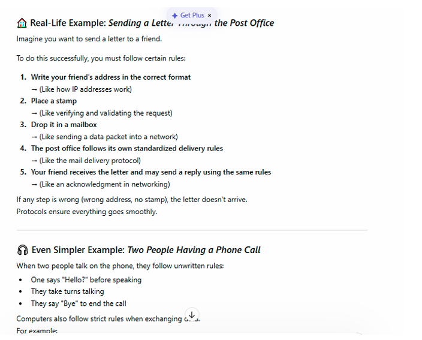
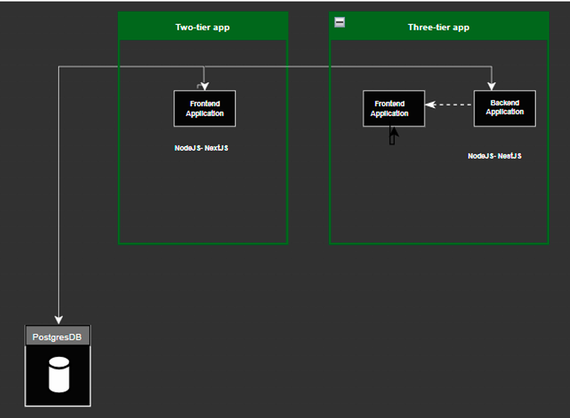
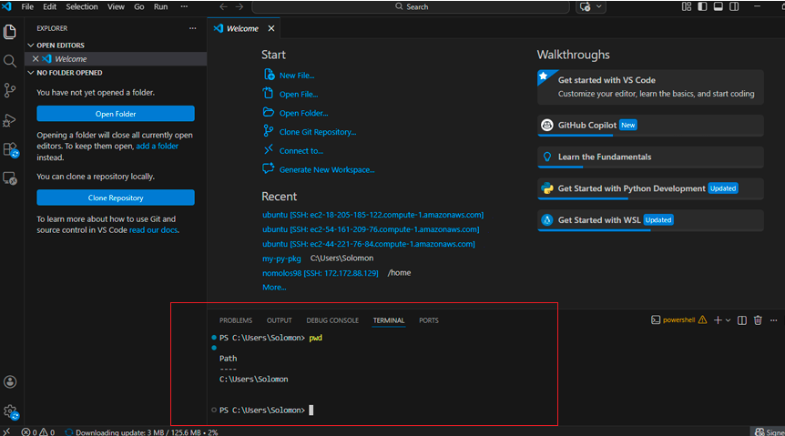

# Week 00 - Internet and Networking

Part of the DevOps Micro Internship (DMI) Cohort 3 with Agentic AI

---

# 🧑‍💻 Task 1: Using ChatGPT as Your Learning Assistant

## Scenario

You're new to DevOps and will frequently encounter technical questions. ChatGPT can be your learning companion.

## Your Task

Write a clear ChatGPT prompt to help you understand:

> "What is a protocol in networking? Explain with a simple real-life example."

Take a screenshot of your interaction showing:

* Your detailed prompt (with clear expectations)
* ChatGPT's simplified response with an example

## Screenshot

Save your screenshot in the `screenshots` folder and update the file name below.




Replace `task-1-chatgpt.png` with your actual screenshot file name.

---

## What I Learned (2–3 lines)

Clear, specific prompts lead to clearer explanations, especially when defining concepts like networking protocols. Detailed prompting also helps shape the tone. Simple, real-life examples made the explanation more relatable and easier to understand

---

# 🌐 Task 2: Internet and Networking

## Scenario

Your friend is launching an online bookstore named **EpicReads**.

He asked you to explain how users globally can access his website hosted in Finland.

## Your Task

Write a short explanation (**100–150 words**) that includes:

* Packet Switching
* IP Address
* TCP/IP
* HTTP/HTTPS

💡 **Tip:** You may use ChatGPT (as demonstrated in Task 1) to refine your explanation.

## Answer

When someone anywhere in the world types epicreads.com, the request travels through the internet and is broken into tiny data packets, just like splitting a long letter into small envelopes so they travel faster. Each packet may take different routes across global networks before reaching the EpicReads server in Finland.
The server hosting EpicReads has a unique IP address, which acts like its home address on the internet. The browser then finds the website’s IP address, which works like the server’s home address so the packets know exactly where to go. Using TCP/IP, IP chooses the best route for each packet, while TCP makes sure all packets arrive safely, in order, and are resent if lost.
When the user’s browser loads the website, its communication uses HTTP or HTTPS, which protects the data like a sealed, encrypted envelope (unlike HTTP, which is open like a postcard).
All this happens in milliseconds, making EpicReads quick and accessible worldwide.

---

# 🏗️ Task 3: Application Architecture & Stack

## Scenario

EpicReads bookstore has two application versions:

### Two-Tier Application

* Frontend
* Database

### Three-Tier Application

* Frontend
* Backend
* Database

## Your Task

* Draw simple diagrams (hand-drawn or tool-based such as draw.io)
* Label each layer clearly
* List at least two common technologies or tools used for each layer
* Submit a screenshot or photo clearly showing your own drawing

## Diagram Screenshot / Photo

Save your diagram image in the `screenshots` folder and update the file name below.




Replace `task-3-diagram.png` with your actual diagram file name.

---

## Technologies Used

### Frontend

* Node.JS
* Next.JS

### Backend

* Node.JS
* Nest.JS

### Database

* PostgresDB

---

# 🌍 Task 4: Domain Name & DNS (Basic Concepts)

## Scenario

Your friend's bookstore **EpicReads** is currently accessible through:

```text
52.172.142.222:3000
```

He purchased the domain:

```text
epicreads.com
```

## Your Task

In **50–100 words**, explain in your own words:

1. What is DNS (Domain Name System)?
2. Which DNS record type should be used to connect the domain to the given IP, and why?

## Answer

- i. The Domain Name System (DNS) Imagine you want to call your friend but you don’t remember their phone number. You open a phone book and look up their name to find the number. DNS works like the internet’s phone book
When someone types epicreads.com in their browser, the DNS translates this human-friendly name into the server’s IP address (52.172.142.222) so the browser knows where to send the request. 

- ii To connect a domain to an IPv4 address, we use an A record.
 Example:

| Domain Name   | Record Type | IP Address      |
|---------------|-------------|-----------------|
| epicreads.com | A           | 52.172.142.222  |

This tells the browser: “If someone types epicreads.com, go to 52.172.142.222.”

---

# 💻 Task 5: Visual Studio Code Setup (Hands-on)

## Your Task

Install Visual Studio Code (if not already installed).

Take a screenshot of your VS Code environment showing:

* Terminal open inside VS Code
* Running a basic command:

### Windows

```powershell
dir
```

### Linux / macOS

```bash
pwd
ls
```

* Your selected VS Code theme clearly visible

⚠️ **Important:** The screenshot must show your username or another identifiable detail to confirm it is your environment.

## Screenshot

Save your screenshot in the `screenshots` folder and update the file name below.




Replace `task-5-vscode.png` with your actual screenshot file name.

---

# 🔗 Task 6: Publish Your Assignment as a LinkedIn Post

## Objective

Publishing on LinkedIn helps you:

* Build your professional online presence
* Reinforce your learning
* Document your DevOps journey publicly

## Your Task

Summarize your answers from Tasks 1–5 into a LinkedIn post.

Clearly structure your post into the following sections:

* ChatGPT
* Internet & Networking
* App Architecture
* DNS
* VS Code Setup

Add the following credit note at the end of your post:

> **P.S. This post is part of the DevOps Micro Internship (DMI) with Agentic AI — Cohort 3 — by Pravin Mishra. My graded progress is public: https://dmi.pravinmishra.com/s/YOUR-GITHUB-USERNAME.html · Start your DevOps journey: https://dmi.pravinmishra.com/?utm_source=student&utm_medium=ps-linkedin&utm_campaign=cohort3**

---

## LinkedIn Post URL

Paste your LinkedIn post URL here:

```text
https://www.linkedin.com/posts/solomonanichebe_devops-cloudengineering-learninginpublic-share-7443245885259669504-E370/?utm_source=share&utm_medium=member_desktop&rcm=ACoAAAXBpdEBaUln31DVzGUPS7Q7mpZjlUYg8QY
```

---

## LinkedIn Post Backup Copy

Paste the full text of your LinkedIn post here:

Building My DevOps Fundamentals for DevOps Micro Internship (DMI) Cohort 3: The Week tasks just leveled up my fundamentals in networking, architecture, and tools. These basics are game-changers before diving further. Here's what I learned:
 
1️. ChatGPT as your Learning companion
Using ChatGPT for interactive prompting and setting clear expectations is crucial key. Tailoring the prompt helps to set expectations get spot-on answers appropriately. Also, follow-up questions help clarify concepts further, breaking down touch concepts into simple understandable analogies, this is total game changer for learning.
 
2️. Internet & Networking
Learn the concept of the internet and networking and how Devices connect globally via IP addresses, TCP/IP (reliable data delivery), packet switching (splitting data for fast travel), HTTP/HTTPS (secure browser-server chats), and ports.
 
3️. Application Architecture
The App architectures structure how frontend, backend and database interact, which directly impacts deployment and provisioning suitable resources, ensuring scalability, and isolating issues efficiently.
 
Two-tier architecture: Frontend → Database
This setup links the frontend directly to the database. It places business logic either on the client side or in the database server, which may scale poorly
Three-tier architecture: Frontend → Backend → Database
The backend layer sits between the frontend and database to handle logic, queries, and security. This is secure, scalable and the standard for production systems.
 
4️. Domain Name System(DNS) 
DNS translates human-friendly names (e.g., EpicReads.com) to IP addresses (e.g., 192.0.2.1). This explain how a website like EpicReads.com is accessed globally, DNS grabs the IP, data packets zip across networks, and boom the site loads in seconds.
 
5️. VS Code Setup
This is an essential tool for DevOps engineers and Set up Visual Studio Code (VS Code) for a DevOps environment and configured it for productivity. 
 

P.S. This post is part of the FREE DevOps Micro Internship (DMI) Cohort 3 by Pravin Mishra. You can be part of this learning community too.
You can JOIN HERE https://lnkd.in/erQUNP99
DMI Cohort 3: https://lnkd.in/dzF-P-vZ

#DevOps #CloudEngineering #LearningInPublic #TechCommunity #techskills

---

# Reflection – Week 0

### What did you find easy?

Using ChatGPT for interactive prompting and for setting clear crucial expectations. Tailoring the prompt helps to set expectations to receive answers appropriately. Also, follow-up questions help clarify concepts further, breaking down technical terms into understandable analogies.
 
---

### What was difficult?

Drawing the two-tier and three-tier application architecture diagrams at first seem touch at first, at last i was able to labelled each layer, and listed common technologies/tools used in frontend, backend, and database layers. Also setting up the Visual Studio Code (VS Code) for a DevOps environment and configured it for productivity

---

### What will you improve next week?

Read, practise deeper, and change mindset in my internship and set extra time for the DMI

---

## 📌 About DMI & CloudAdvisory

DevOps Micro Internship (DMI) is a project-based DevOps program run by Pravin Mishra (The CloudAdvisory) focused on real-world execution, systems thinking, and career readiness.

It helps learners build strong DevOps foundations with hands-on experience.


## 📌 Resources

- 🌐 **DMI Official Website:** https://pravinmishra.com/dmi  
- 🎓 **DevOps for Beginners (Udemy):** https://www.udemy.com/course/devops-for-beginners-docker-k8s-cloud-cicd-4-projects/  
- 🎓 **Ultimate Agentic AI DevOps with Clude Code** https://www.udemy.com/course/ultimate-agentic-ai-devops-with-claude-code/?referralCode=448389767BC96284087B
- 🎓 **DevOps with Claude Code: Terraform, EKS, ArgoCD & Helm** https://www.udemy.com/course/devops-with-claude-code-terraform-eks-argocd-helm/?referralCode=1C5B734505D65A010FA3
- ▶️ **YouTube Playlist (DMI Cohort 3):** https://www.youtube.com/playlist?list=PLFeSNDtI4Cho  
- 🔗 **Pravin Mishra (LinkedIn):** https://www.linkedin.com/in/pravin-mishra-aws-trainer/  
- 🏢 **CloudAdvisory (LinkedIn):** https://www.linkedin.com/company/thecloudadvisory/

---

*This submission is part of DevOps Micro Internship (DMI) Cohort 3 — Agentic AI Track*