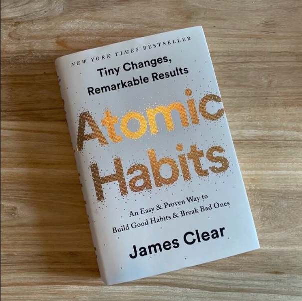
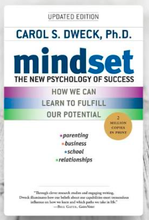
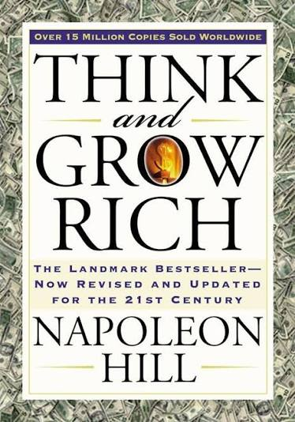
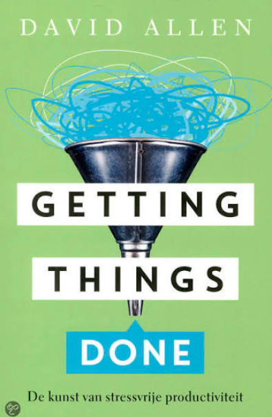
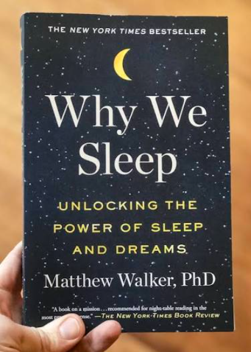
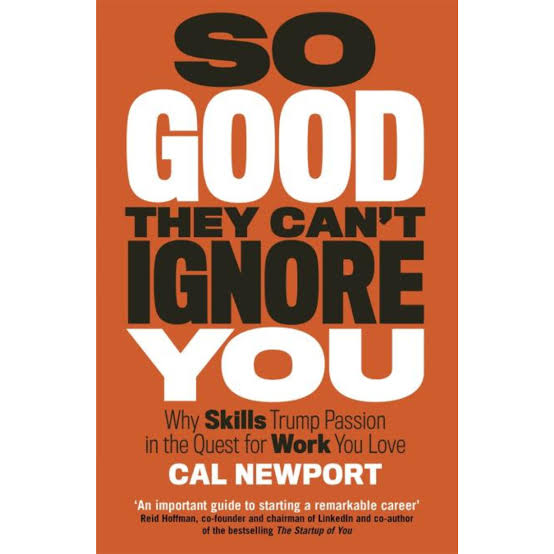
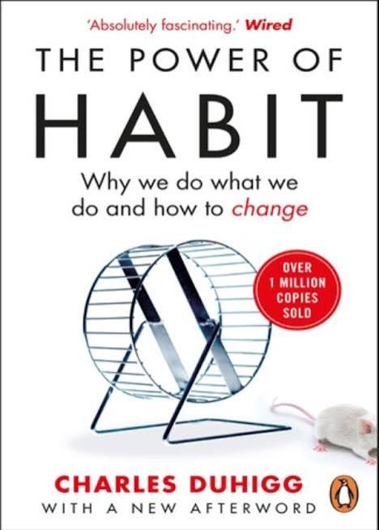
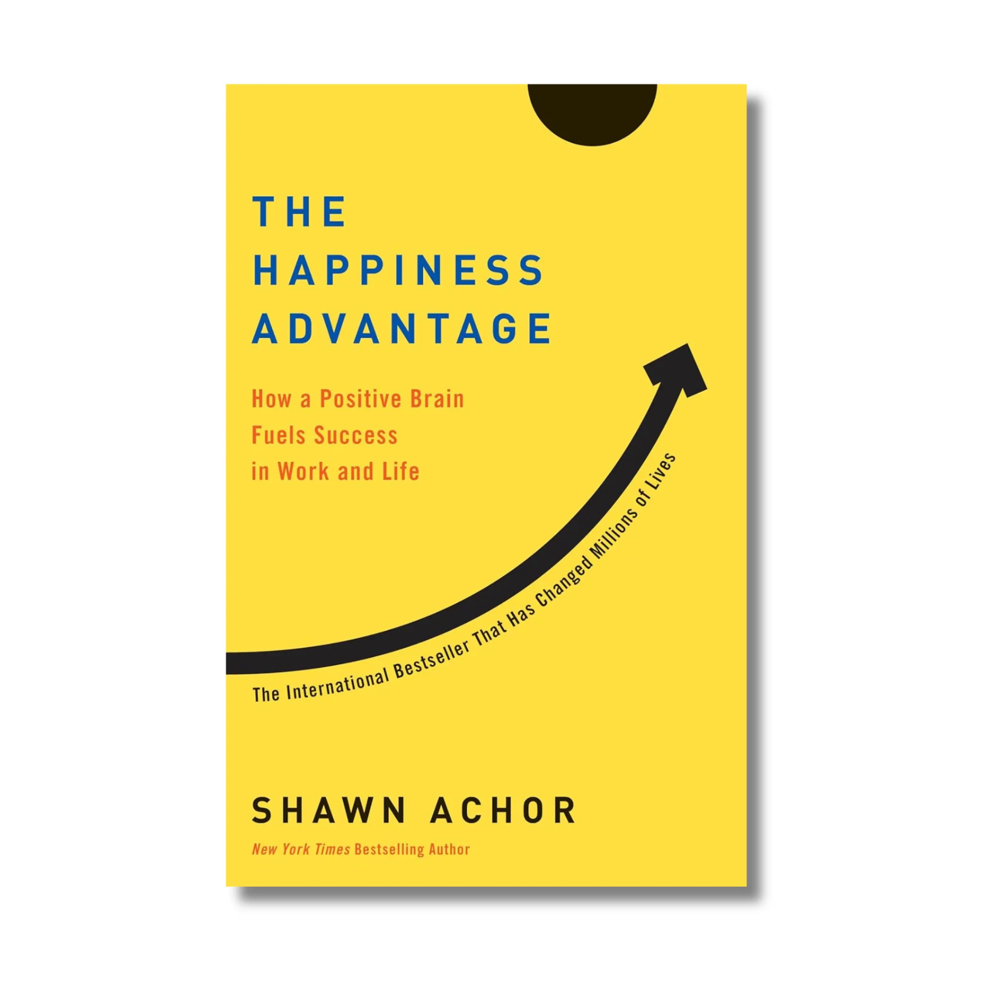
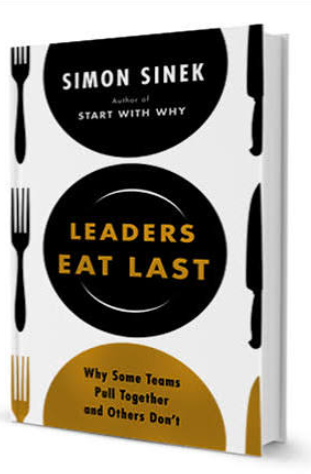
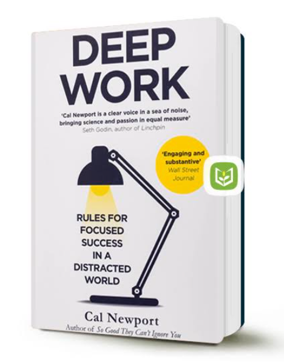

# Week 01 — Success Mindset (Mindset OS)

Part of the DevOps Micro Internship (DMI) Cohort 3 with Agentic AI

---

## Purpose (Read This First)

This week is not motivation homework.

This is you building your **Mindset OS** — the system you will use for the next 5 months (and honestly, for years).

### Expectations

* Be honest.
* Be specific.
* Be practical.
* Write like an adult professional: clear sentences, no one-liners.

You will reuse this in later weeks. So do it properly once.

---

# Assignment 1. What is something you believe to be true that most people around you would disagree with?

### Rules

* No "safe" answers.
* Must be your real belief (not copied from internet).
* Minimum 50 words.

**Hint:** What do you believe about career, money, learning, discipline, relationships, health, success, life, tech industry, etc. that most people don't agree with?

## Answer

I believe consistency beats intensity in career growth, and most people around me would disagree because they still trust motivation, paying huge amount for IT training, having all access to many resources. So, steady execution over time by keep showing up, documenting, practicing, and building portfolio from small usually win. 

---

# Assignment 2. What are the top 3 objective truths you discovered through experimentation and results?

### Definition

Objective truths do not depend on opinions. They hold true regardless of how people feel.

Write each truth in this format:

**Truth:** (1 sentence)

**Evidence from my life:** (2–4 lines: what you tried + what happened)

---

## Truth #1

### Truth

Repetition and consistency build skill more effectively than occasional bursts of motivation.

### Evidence from my life

Since I started with DevOps two years ago and participated in regular WhatsApp self-training sessions with like-minded DevOps enthusiasts, I have retained more information and understood the concepts little individually and not real-world experience. Whenever I tried to rush through much at once, I became overwhelmed and forgot details quickly. Consistent practice has always given me better results than random intensity.

---

## Truth #2

### Truth

Learning DevOps tools in isolation does not create real-world experience

### Evidence from my life

I have practise individual tools, but that only gave me theory and familiarity. It did not fully teach me how the tools work together in a real world workflow. This micro internship, even with the small introduction, mentor coordination, and support for trainees, has already assure me for positivive experience.

---

## Truth #3

### Truth

Proof of work can really creates both visibility and credibility.

### Evidence from my life

Whenever I produce something tangible, such as notes, assignments, and build portfolio, I understand the topic more deeply. I also feel more confident because I can point to real evidence of effort instead of just saying I studied.

---

# Assignment 3. What does your 2.0 version look like?

### Instructions

Write as if a journalist is writing about you **3 to 7 years from now** (not 20 years).

**Minimum 300 words.**

### Rules

* Write in past tense, like it already happened.
* Don't use "likes to / wants to / hopes to."
* Use specifics:

  * built
  * shipped
  * led
  * published
  * earned
  * relocated
  * contributed
* Include skills proof:

  * projects
  * portfolios
  * GitHub
  * blogs
  * certifications
  * job role
  * leadership
  * community contribution
* Add 1–3 images if you can (optional but powerful).

### Publish It Publicly On Any ONE

* LinkedIn
* Medium
* WordPress
* Blogspot
* Personal blog
* Portfolio page

Include this line:

**P.S. This post is part of the DevOps Micro Internship (DMI) with Agentic AI — Cohort 3 — by [Pravin Mishra](https://www.linkedin.com/in/pravin-mishra-aws-trainer/). My graded progress is public: https://dmi.pravinmishra.com/s/YOUR-GITHUB-USERNAME.html · Start your DevOps journey: https://dmi.pravinmishra.com/?utm_source=student&utm_medium=ps-blog&utm_campaign=cohort3**

## Your Article

My Version 2.0 Five years from now, would had grown into a strong DevOps and Agentic AI Engineer. A professional with a strong reputation for positive habits, discipline, consistency, practical delivery, and clear thinking after completing structured DevOps Micro Internship with Agentic AI that showed real world capability. He had moved beyond learning tools in isolation and built a solid body of work across Linux administration, Git/GitHub workflows, containerization, kubernetes, orchestration, CI/CD, and cloud infrastructure learning across AWS and Azure with growing focus on Agentic AI, automation, and AI-assisted engineering workflows.

As an engineer, I have worked and built real world Industry-recognized cloud infrastructure that powers real businesses. My portfolio reflects years of solving real-world problems through from backend engineering, infrastructure automation, Agentic AI to automation, and AI-assisted DevOps workflows. All these projects were documented in my portfolio and GitHub repository, making the progress visible and easy to verify. Rather than waiting for perfect conditions, i learned to build, test, improve, and publish as i went.

Also strengthened his professional profile through blogs, technical writeups, and portfolio-driven visibility. The blog posts and project notes showed that i could explain ideas clearly, not just execute them. Also includes relevant industry recognized cloud certifications that complement his experience, and continued building proof that his skills were real and industry accepted. This made his profile stronger for employers because it reflected both technical ability and the discipline to communicate what he is learning and building.

Also built a forward-looking identity around automation. In addition to core DevOps skills, he explored Agentic AI as a practical extension of modern engineering work. Studied how AI could support task planning, documentation, troubleshooting, and workflow automation, and he began combining that interest with his DevOps mindset. This made his work more relevant to the future of cloud and platform engineering.

At this stage, he had become the kind of professional who could be trusted to build, lead, document, and contribute with consistency to cloud technology. The GitHub, portfolio, certifications, blogs, and community collaboration all pointed to the same truth he had turned discipline into visible results. He was no longer defined by what he was learning; he was defined by what he had built, shipped, documented, and contributed.

This post is a part of DevOps Micro Internship with Agentic AI Cohort-3 by [Pravin Mishra](https://www.linkedin.com/in/pravin-mishra-aws-trainer/). 

You can start your DevOps journey by joining this [Discord community](https://discord.pravinmishra.com/) ( https://discord.pravinmishra.com/ )

### Public Link

Paste your link here:

`https://www.linkedin.com/posts/solomonanichebe_join-the-dmi-devops-micro-internship-share-7478723066529980416-PELs/?utm_source=share&utm_medium=member_desktop&rcm=ACoAAAXBpdEBaUln31DVzGUPS7Q7mpZjlUYg8QY`

---

# Assignment 4. Have you ever cut corners (unethical / dishonest / shortcut behavior — not necessarily illegal)? If yes, how did it make you feel?

### Important

You don't need to write the full story.

Focus on the feeling:

* guilt
* fear
* shame
* stress
* regret
* numbness
* etc.

This is about self-awareness, not judgment.

### Answer Format

**Yes**

If Yes:

**What emotion did you feel?** (minimum 50–100 words)

## Answer

I have cut corners before, and the main emotion I felt was numbness. I knew it did not reflect my standard and what I wanted for myself. That created guilt and quiet regret because part of me understood that I had chosen speed over integrity and consistency. The feeling stayed with me longer than the benefit of the shortcut, and it reminded me that dishonesty often brings more internal stress than real progress.

---

# Assignment 5. What are 10 non-fiction books you plan to read in the next 1 year?

### Rules

* Mention **Title + Author**
* Any language allowed
* No fiction novels

### Tip

Choose books that improve:

* mindset
* communication
* productivity
* health
* money
* career
* leadership

## Book List

1. Atomic Habits — James Clear

2. Mindset — Carol S. Dweck

3. Think and Grow Rich — Napoleon Hill

4. Getting Things Done — David Allen

5. Why We Sleep — Matthew Walker

6. So Good They Can’t Ignore You — Cal Newport

7. The Power of Habit — Charles Duhigg

8. The Happiness Advantage — Shawn Achor

9. Leaders Eat Last — Simon Sinek

10. Deep Work — Cal Newport

---

# Assignment 6. What are the things you will measure regularly in your life and career?

### Rules

List topics only. No need to share numbers.

### Must Include

* Learning / skill
* Output / proof
* Health / energy
* Time / focus
* Money / finance (personal or business)

### Example

* Learning hours per week
* Deep work sessions per week
* Projects shipped / documented
* Steps / workouts
* Sleep hours
* Spending tracker

## My Metrics

* Learning hours per week.
* Deep work sessions per week.
* Projects shipped.
* Documentation published.
* GitHub commits.
* Sleep hours.
* Workout.
* Energy level.
* Focus time.
* Personal spending.

---

# Assignment 7. Brain Dump + 5-Month System Plan

## Step 1: Brain Dump (Private)

Do a brain dump of everything in your mind into a notebook.

Examples:

* Bills
* Tasks
* Worries
* Goals
* Pending messages
* Ideas
* Responsibilities

### Did You Do It?

**Yes**

Answer:

I need to reply to whatsapp message. I still have a bill to pay

---

## Step 2: Your 5-Month Routine + Focus Blocks

Create a simple plan you can realistically follow for the next 5 months.

### Weekly Routine

Example:

* Mon–Thu: 60 min deep work
* Sat: DMI session
* Sun: Weekly review

#### My Weekly Routine

Commit 30mins exercise everyday
Monday to Thursday: 3 hours each day for assignment and study/practical. 
Saturday: 8hrs session without distraction. 
Sunday: 2hrs to review and plan.

---

### Focus Blocks

#### When Will You Do DMI Work? (Days + Time)

9am -12pm WAT (Monday to Thursday)
5.30am - 1:30pm (Saturday)
No specific time, but when i am back from church service, i have good 2hrs for review/planning

#### How Many Sessions Per Week?

12hrs Mon-Thur 
8hrs Sat
2hrs Sun

Total of 22hrs Per Week

---

### Distraction Rules

Examples:

* Phone rules
* Social media rules
* Environment setup

#### My Distraction Rules

Staying away from social media and youtube videos and focus on DMI program.

---

# Reflection – Week 1

### Biggest insight I got about myself this week

My biggest insight is i can achieve DMI prgram with mindset focused positive thought, consistency, and discipline. My veersion 2.0 will now reflects the kind of person I want to be which centered on postive mindset toward DMI cohort 3, intentionality regarding positive habits, and discipline. Also I know already the Micro internship is successful through the support session given by co-mentors to know how things will be.

### My biggest weakness/loop I noticed

Alway wanting to watch youtube like its my relaxing tool. Engaging so much on social media even when i have engagement and my mind we will be telling me to do my study later, which is procastination. I also notice i could have finished up on Tuesday but i delay it to thursday, showing lack of discipline and focus.

### One system I will implement from this week (exact habit + time)

I will spend 3hour every day morning 9AM to 12PM on DMI tasks withour phone, social media, or any distraction. MY 8hrs every Saturday without my phone or social media in other to build and protect my future development.

### LinkedIn Post

Paste your LinkedIn post link here:

`https://www.linkedin.com/posts/solomonanichebe_join-the-dmi-devops-micro-internship-share-7478723066529980416-PELs/?utm_source=share&utm_medium=member_desktop&rcm=ACoAAAXBpdEBaUln31DVzGUPS7Q7mpZjlUYg8QY`

---

## 10. Proof of Work

- LinkedIn Post URL: **https://www.linkedin.com/posts/solomonanichebe_join-the-dmi-devops-micro-internship-share-7478723066529980416-PELs/?utm_source=share&utm_medium=member_desktop&rcm=ACoAAAXBpdEBaUln31DVzGUPS7Q7mpZjlUYg8QY**

- Blog / Medium : **https://medium.com/@jobcreation2009/what-my-version-2-0-looks-like-0915a6db7e12?sharedUserId=jobcreation2009**  

---

## 📌 About DMI & CloudAdvisory

DevOps Micro Internship (DMI) is a project-based DevOps program run by Pravin Mishra (The CloudAdvisory) focused on real-world execution, systems thinking, and career readiness.

It helps learners build strong DevOps foundations with hands-on experience.

## 📌 Resources

- 🌐 **DMI Official Website:** https://pravinmishra.com/dmi  
- 🎓 **DevOps for Beginners (Udemy):** https://www.udemy.com/course/devops-for-beginners-docker-k8s-cloud-cicd-4-projects/  
- 🎓 **Ultimate Agentic AI DevOps with Clude Code** https://www.udemy.com/course/ultimate-agentic-ai-devops-with-claude-code/?referralCode=448389767BC96284087B
- 🎓 **DevOps with Claude Code: Terraform, EKS, ArgoCD & Helm** https://www.udemy.com/course/devops-with-claude-code-terraform-eks-argocd-helm/?referralCode=1C5B734505D65A010FA3
- ▶️ **YouTube Playlist (DMI Cohort 3):** https://www.youtube.com/playlist?list=PLFeSNDtI4Cho  
- 🔗 **Pravin Mishra (LinkedIn):** https://www.linkedin.com/in/pravin-mishra-aws-trainer/  
- 🏢 **CloudAdvisory (LinkedIn):** https://www.linkedin.com/company/thecloudadvisory/

---

*This submission is part of DevOps Micro Internship (DMI) Cohort 3 — Agentic AI Track*