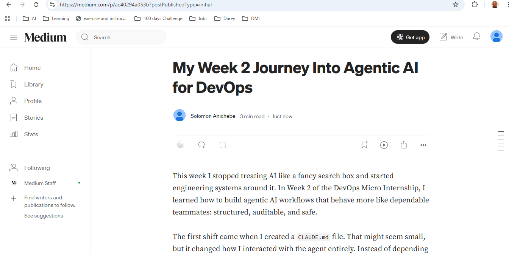
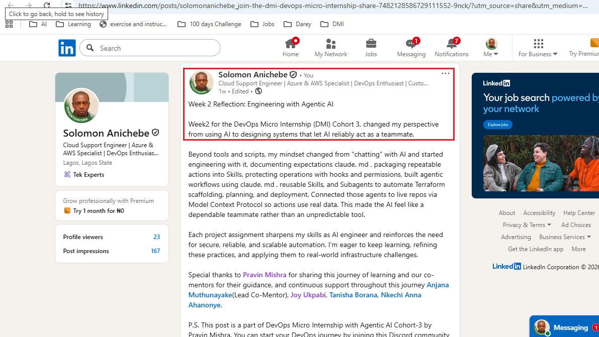

# Assignment 8 — Week 2 Reflection Blog

Part of the DevOps Micro Internship (DMI) Cohort 3 with Agentic AI

---

# Purpose

In this assignment, you will reflect on your Week 2 learning journey and write a short blog capturing your experience working with Agentic AI tools such as Claude Code, Skills, Subagents, MCP, Hooks, Permissions, and Memory.

You will also publish a LinkedIn post summarizing your learning and share both links for evaluation.

---

# Task 1 — Write Your Reflection Blog

## Goal

Write a reflection blog covering your Week 2 learning experience.

### Blog Requirements

Your blog must include:

* Title: **Reflection – Week 2**
* Minimum 300 words
* At least 2–3 topics from Week 2 (Claude Code, Skills, Subagents, MCP, Hooks, Permissions, Memory)
* Honest personal reflection (learning, challenges, mindset)
* One habit/system you plan to implement
* Your full name clearly visible

### Allowed Platforms

You can publish your blog on:

* Hashnode
* Medium
* Dev.to
* LinkedIn Article
* GitHub Markdown file
* Substack

---

### Evidence

#### Screenshot 1 — Blog published and visible



---

### Submission Field

Blog Link:

`https://medium.com/p/ae40294a053b?postPublishedType=initial`

---

# Task 2 — Create LinkedIn Post

## Goal

Share your Week 2 learning publicly on LinkedIn.

---

### LinkedIn Post Requirements

Your post must include:

* One screenshot from any Week 2 assignment
* Short reflection (what you learned or built)
* Required P.S. line exactly as given below

---

### Required P.S. Line (Must Include Exactly)

**P.S. This post is part of the DevOps Micro Internship (DMI) with Agentic AI — Cohort 3 — by [Pravin Mishra](https://www.linkedin.com/in/pravin-mishra-aws-trainer/). My graded progress is public: https://dmi.pravinmishra.com/s/YOUR-GITHUB-USERNAME.html · Start your DevOps journey: https://dmi.pravinmishra.com/?utm_source=student&utm_medium=ps-linkedin&utm_campaign=cohort3**

---

### Suggested Hashtags

#DMIByPravinMishra #AgenticAI #ClaudeCode #DevOps #LearningInPublic

---

### Evidence

#### Screenshot 2 — LinkedIn post published



---

### Submission Field

LinkedIn Post Content (copy-paste here):

```
Week 2 Reflection: Engineering with Agentic AI

Week2 for the DevOps Micro Internship (DMI) Cohort 3, changed my perspective from using AI to designing systems that let AI reliably act as a teammate. 

Beyond tools and scripts, my mindset changed from “chatting” with AI and started engineering with it, documenting expectations claude. md , packaging repeatable actions into Skills, protecting operations with hooks and permissions, built agentic workflows using claude. md , reusable Skills, and Subagents to automate Terraform scaffolding, planning, and deployment. Connected those agents to live repos via Model Context Protocol so actions use real data. This made the AI feel like a dependable teammate rather than an unpredictable tool.

Each project assignment sharpens my skills as AI engineer and reinforces the need for secure, reliable, and scalable automation. I’m eager to keep learning, refining these practices, and applying them to real-world infrastructure challenges.

Special thanks to Pravin Mishra for sharing this journey of learning and our co-mentors for their guidance, and continuous support throughout this journey Anjana Muthunayake(Lead Co-Mentor), Joy Ukpabi, Tanisha Borana, Nkechi Anna Ahanonye.

P.S. This post is a part of DevOps Micro Internship with Agentic AI Cohort-3 by Pravin Mishra. You can start your DevOps journey by joining this Discord community ( https://lnkd.in/dEauBgd6 ).
hashtag#DMIByPravinMishra hashtag#AgenticAI hashtag#ClaudeCode hashtag#DevOps hashtag#LearningInPublic

```

---

### LinkedIn Post Link:

`https://www.linkedin.com/posts/solomonanichebe_join-the-dmi-devops-micro-internship-share-7482128586729111552-9nck/?utm_source=share&utm_medium=member_desktop&rcm=ACoAAAXBpdEBaUln31DVzGUPS7Q7mpZjlUYg8QY`


---

# Submission Instructions

* Blog must be publicly accessible
* LinkedIn post must be visible (public or unlisted where applicable)
* All required fields must be filled
* Screenshot proofs must be added to GitHub repository
* Do not include sensitive information in blog or post

---

# Completion Checklist

* [ ] Blog written with required structure
* [ ] Blog includes at least 2–3 Week 2 topics
* [ ] Blog is publicly accessible
* [ ] LinkedIn post created
* [ ] Required P.S. line included
* [ ] LinkedIn post content copied in submission field
* [ ] Blog link added
* [ ] LinkedIn post link added
* [ ] Screenshots added to GitHub repo

---

# About DMI & CloudAdvisory

DevOps Micro Internship (DMI) is a project-based DevOps program run by Pravin Mishra (The CloudAdvisory), focused on real-world execution, systems thinking, and agentic AI workflows.

It helps learners build strong DevOps foundations through hands-on experience.

---

# Resources

* 🌐 DMI Official Website: [https://pravinmishra.com/dmi](https://pravinmishra.com/dmi)
* 🎓 DevOps for Beginners (Udemy): [https://www.udemy.com/course/devops-for-beginners-docker-k8s-cloud-cicd-4-projects/](https://www.udemy.com/course/devops-for-beginners-docker-k8s-cloud-cicd-4-projects/)
* 🎓 Agentic AI DevOps with Claude Code: [https://www.udemy.com/course/ultimate-agentic-ai-devops-with-claude-code/](https://www.udemy.com/course/ultimate-agentic-ai-devops-with-claude-code/)
* 🎓 DevOps with Claude Code: Terraform, EKS, ArgoCD & Helm: [https://www.udemy.com/course/devops-with-claude-code-terraform-eks-argocd-helm/](https://www.udemy.com/course/devops-with-claude-code-terraform-eks-argocd-helm/)
* ▶️ YouTube Playlist: [https://www.youtube.com/playlist?list=PLFeSNDtI4Cho](https://www.youtube.com/playlist?list=PLFeSNDtI4Cho)
* 🔗 Pravin Mishra (LinkedIn): [https://www.linkedin.com/in/pravin-mishra-aws-trainer/](https://www.linkedin.com/in/pravin-mishra-aws-trainer/)
* 🏢 CloudAdvisory (LinkedIn): [https://www.linkedin.com/company/thecloudadvisory/](https://www.linkedin.com/company/thecloudadvisory/)

