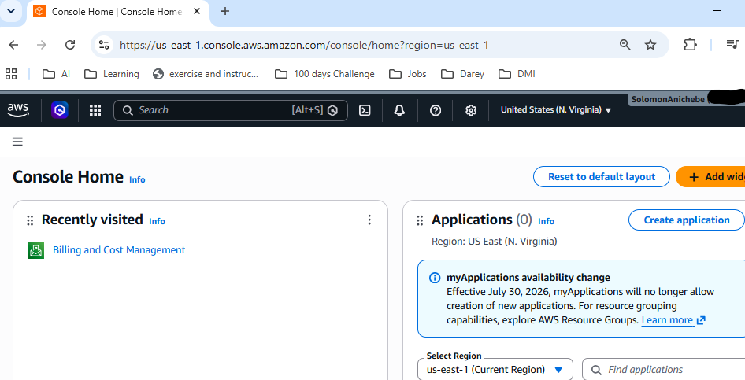

# Assignment 1 — AWS Free Tier Account Setup (EpicReads Cloud Onboarding)

Part of the DevOps Micro Internship (DMI) Cohort 3 with Agentic AI

---

## Purpose

In this assignment, you will create and verify an AWS Free Tier account as part of onboarding EpicReads — an online bookstore moving to the cloud. You will demonstrate an understanding of AWS fundamentals, Free Tier services, and account setup by answering conceptual questions and capturing proof of a working AWS Console login.

---

# Task 1 — Understanding AWS & Free Tier

## Goal

Demonstrate understanding of AWS basics and Free Tier usage by answering the following questions in your own words (3–4 lines each).

### Answers

#### Question 1 — What is an AWS account, and why do you need it at this stage?

An AWS account is a container used to create AWS resources and access control. 
So we need it now because it is the first step to creating, managing, and securely isolating anything you build on AWS and also every service you will practice with in AWS like storage, compute, or databases must live inside an account.

---

#### Question 2 — What is AWS Free Tier, and how long does it last?

AWS Free Tier is a set of free offers where you try selected services without immediate charges, as long as you stay within the free usage limits.

For a new AWS account created after July 2025, the AWS Free Tier lasts 6 months from the day you open the account and you get up to $200 in credits in total, but it begins with $100 in credits immediately plus the chance to earn up to $100 more. The account closes on its own 6 months after you open it or when your credits run out, whichever comes first. You won’t be charged unless you convert to a Paid plan.

---

#### Question 3 — Name three AWS Free Tier services and their free usage limits.

Amazon EC2 - AWS gives credits based instance for use and is available within the account’s Free Plan limits.
Amazon S3 - 5 GB of standard storage for the period.
AWS lambda - 1 million free requests per month under the Always Free-style offer.

---

# Task 2 — Create AWS Free Tier Account

## Goal

Create a valid AWS Free Tier account and sign in to the AWS Management Console.

> No screenshots required for this task. Completion is verified through Task 3.

---

# Task 3 — Verify AWS Account

## Goal

Confirm that your AWS account setup is complete by navigating to the Account section and capturing proof.

### Evidence

#### Screenshot 1 — AWS Account page showing account name (email may be blurred)

---

# Submission Instructions

- Add all required screenshots in your GitHub repository submission
- Full name must be visible in required screenshots
- Do not expose sensitive information (keys, passwords, account IDs)

---

# Completion Checklist

- [ ] Task 1 answers written in own words
- [ ] AWS Free Tier account created successfully
- [ ] Signed in to AWS Management Console
- [ ] Screenshot of AWS Account page captured (full name visible, no sensitive data)
- [ ] All required screenshots added to repository

---

## 📌 About DMI & CloudAdvisory

DevOps Micro Internship (DMI) is a project-based DevOps program run by Pravin Mishra (The CloudAdvisory) focused on real-world execution, systems thinking, and career readiness.

It helps learners build strong DevOps foundations with hands-on experience.

---

## 📌 Resources

- 🌐 DMI Official Website: https://pravinmishra.com/dmi  
- 🎓 DevOps for Beginners (Udemy): https://www.udemy.com/course/devops-for-beginners-docker-k8s-cloud-cicd-4-projects/  
- 🎓 Agentic AI DevOps with Claude Code: https://www.udemy.com/course/ultimate-agentic-ai-devops-with-claude-code/  
- 🎓 DevOps with Claude Code: Terraform, EKS, ArgoCD & Helm: https://www.udemy.com/course/devops-with-claude-code-terraform-eks-argocd-helm/  
- ▶️ YouTube Playlist: https://www.youtube.com/playlist?list=PLFeSNDtI4Cho  
- 🔗 Pravin Mishra (LinkedIn): https://www.linkedin.com/in/pravin-mishra-aws-trainer/  
- 🏢 CloudAdvisory (LinkedIn): https://www.linkedin.com/company/thecloudadvisory/

---

*This submission is part of DevOps Micro Internship (DMI) Cohort 3 — Agentic AI Track.*