# Assignment 3 — Production Maintenance Drill (OPS Checklist)

Part of the DevOps Micro Internship (DMI) Cohort 3 with Agentic AI

---

## Purpose

In this assignment, you will treat your already deployed React application (on Ubuntu VM with Nginx) as a live production system. You will perform structured operational checks covering network validation, service health, log analysis, resource monitoring, configuration verification, and incident simulation with recovery — mirroring real on-call DevOps responsibilities.

---

# Task 1 — Server Access & Networking Validation

## Goal

Verify that the deployed React application is reachable from the browser and confirm basic network connectivity of the Ubuntu VM.

### Evidence

#### Screenshot 1 — Browser showing the React app with your Full Name visible on the UI

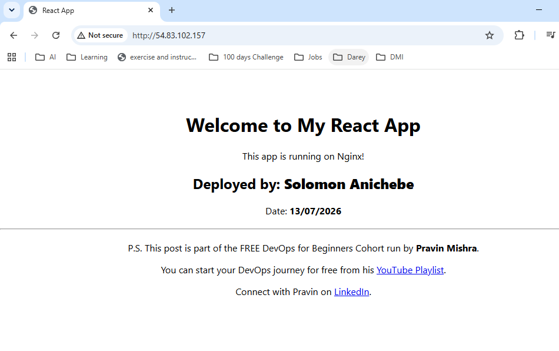

---

#### Screenshot 2 — Output of `ip a`

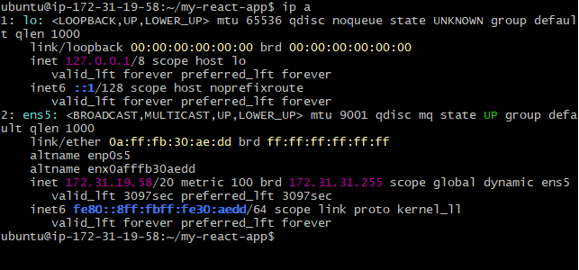

---

#### Screenshot 3 — Output of `sudo ss -tulpen`

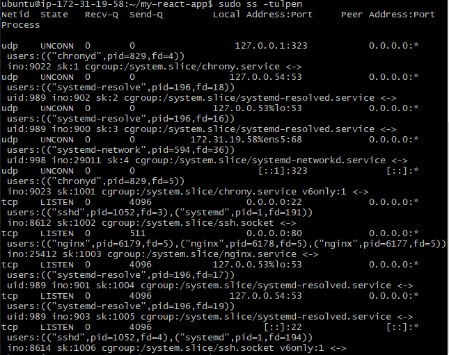

---

#### Screenshot 4 — Output of `sudo ufw status`

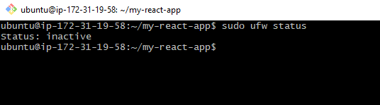

---

### Notes

Answer the following in your own words:

**1. What proves Nginx is listening on 0.0.0.0:80?**

The ss output proof is the line showing nginx bound to 0.0.0.0:80. Meaning Nginx is listening on port 80 and accepting HTTP traffic on all interfaces.

---

**2. What proves SSH is active on port 22?**

SSH is active on port 22 because the ss output shows a LISTEN state on port 22 with sshd as the process.

---

**3. Did you find any unexpected open ports? Explain briefly.**

No i did not find any unexpected open ports. The other ports shown are normal system services like DNS, time sync, and DHCP. We have 22, 80, 53, 323 and 68.

---

# Task 2 — Service Health & Systemd Validation (Nginx)

## Goal

Verify that Nginx is properly installed, running, enabled at boot, and safely configured.

### Evidence

#### Screenshot 1 — Output of `systemctl status nginx --no-pager`

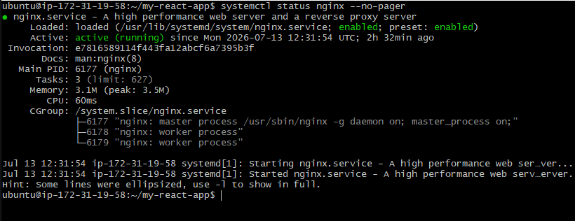

---

#### Screenshot 2 — Output of `sudo nginx -t`

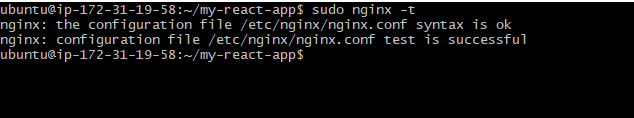

---

#### Screenshot 3 — Output of `sudo ss -lptn '( sport = :80 )'`

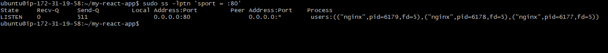

---

### Notes

Answer the following in your own words:

**1. What happens if Nginx fails to restart in production?**

If Nginx fails to restart in production, i would expect a service impact and downtime. Moreover, users may see errors, timeouts, if Nginx is the entry point and it is down. Additionally, the site can go down and users may not be able to access it. That means the server is still there, but the web page is not being served correctly.

---

**2. What's your basic rollback plan?**

My basic rollback plan would be to switch back to the last stable config or release app version, validate it with nginx -t, then restart Nginx and bring the site back up quickly while checking logs for the root cause.

---

# Task 3 — Logs & Request Trace

## Goal

Verify real traffic flow and analyze logs to understand system behavior and errors.

### Evidence

#### Screenshot 1 — Output of `sudo tail -n 30 /var/log/nginx/access.log`

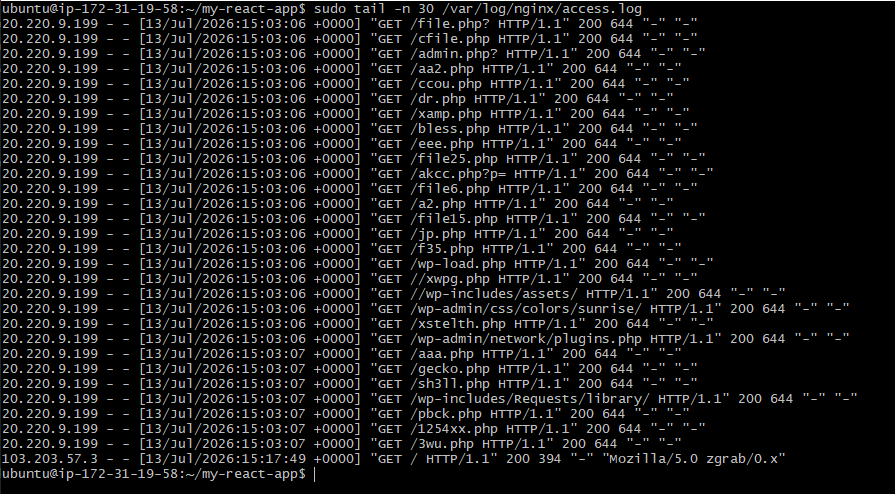

---

#### Screenshot 2 — Output of `sudo tail -n 30 /var/log/nginx/error.log`

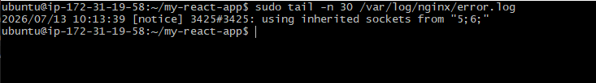

---

#### Screenshot 3 — Output of `sudo journalctl -u nginx --no-pager -n 50`

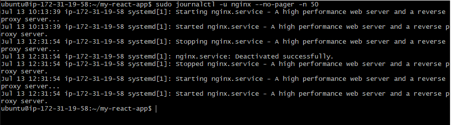

---

### Notes

Answer the following in your own words:

**1. Were there any errors in the logs?**

- If yes, mention 1–2 example error lines from the logs and explain what each one means in simple terms.
- If no, explain what it means if the error log is empty or shows no recent errors during your check.

No real errors were found in the logs; the error log only showed a normal notice like using inherited sockets from "5;6;", not an error or failure and usually just means Nginx kept its listening sockets during a reload or restart

---

**2. If there were no errors, what does that indicate about the system?**

This means Nginx was working normally when commands were executed, and it was not crashing.

---

**3. Based on the access logs, were your curl requests visible in the log entries? What does that prove about traffic flow?**

Yes, the requests were visible in the access log. for example, GET / HTTP/1.1" 200 shows that traffic reached Nginx, and got a successful response.
A 200 means Nginx answered the request normally, so the traffic flow from client to web server is working

---

# Task 4 — System Resource Health Check (Capacity Red Flags)

## Goal

Assess server capacity and detect potential performance or failure risks.

### Evidence

#### Screenshot 1 — Output of `uptime`

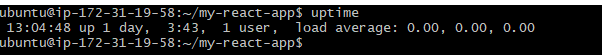

---

#### Screenshot 2 — Output of `free -h`

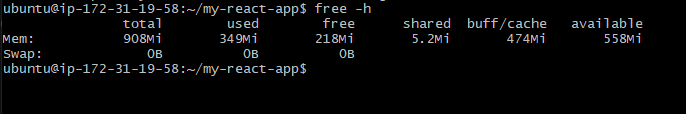

---

#### Screenshot 3 — Output of `df -h`

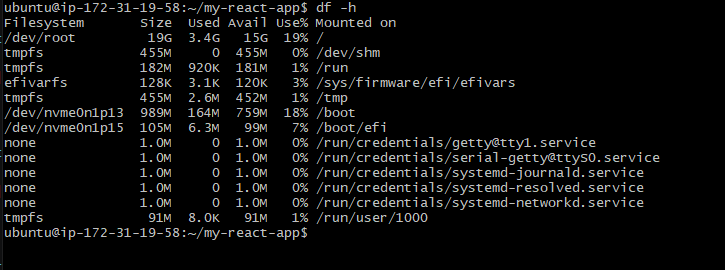

---

#### Screenshot 4 — Output of `sudo du -sh /var/* | sort -h`

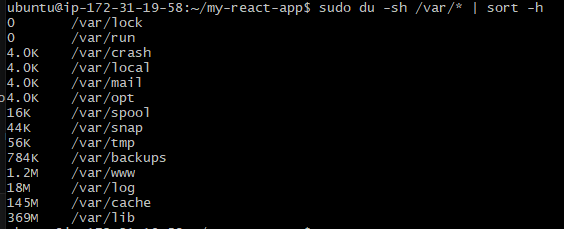

---

### Notes

Answer the following in your own words:

**1. Which resource looks most critical right now? (CPU/load, memory, or disk) Explain why.**

None of the resources looks critical right now; Disk looks the least critical right now. Note the machine has also been up for 1 day,and has not been restarting. while CPU/load is the most healthy and memory is available. The reason is your load average is 0.00, memory still has 559Mi available, and disk is only 19% used, so none of them is under stress right now.

---

**2. What happens if disk becomes 100% full in a production server?**

If disk becomes 100% full meaning no free space left., the server may stop writing files, logs, or app data, and the site can fail. Also the app can break or crash 

If disk becomes 100% full on a production server, the server can stop writing files, logs may stop saving, apps may fail, and the website can break or crash. In simple terms, the server can run out of space to work properly.

---

# Task 5 — Configuration & Deployment Verification

## Goal

Ensure the correct React build is deployed and Nginx is serving it properly.

### Evidence

#### Screenshot 1 — Output of `ls -lah /var/www/html | head -n 20`

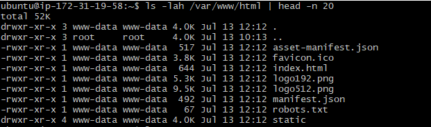

---

#### Screenshot 2 — Output of `grep -R "Deployed by" -n /var/www/html 2>/dev/null | head`

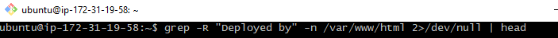
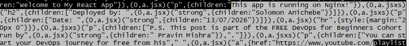

---

#### Screenshot 3 — Output of `grep -n "try_files" /etc/nginx/sites-available/default`

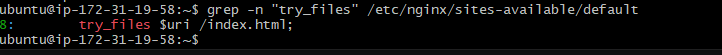

---

### Notes

Answer the following in your own words:

**1. How do you confirm that the correct version of the application is deployed?**

I confirmed the correct version of the application is deployed by checking the production build files.
I compared build/index.html and build/asset-manifest.json on my local project with /var/www/html/index.html and /var/www/html/asset-manifest.json on the server.
The same hashed files were found in both places, such as main.6487cfd3.js and main.e6c13ad2.css.

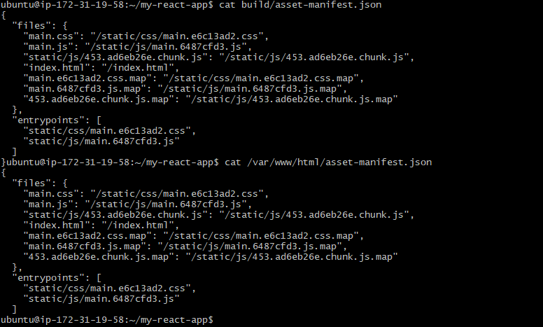

Although this is not a human-friendly app version like 1.0 you see, when you execuate cat package.json

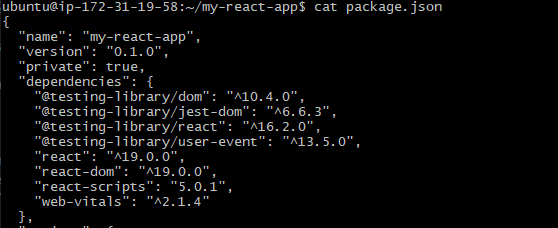

---

# Task 6 — Nginx Configuration Failure Simulation

## Goal

Simulate a real-world Nginx misconfiguration and recover the service safely.

### Evidence

#### Screenshot 1 — Output of `sudo nginx -t` showing the syntax error (broken config)

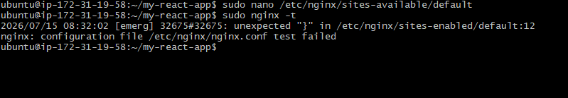

---

#### Screenshot 2 — Output of `sudo nginx -t` showing syntax ok (fixed config)

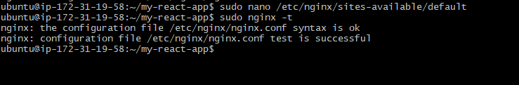

---

#### Screenshot 3 — Output of `curl -I http://<public-ip>` confirming recovery (200 OK)

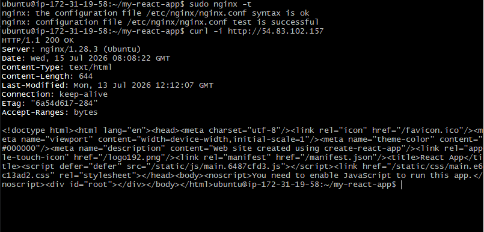

---

### Notes

Answer the following in your own words:

**1. What caused the configuration failure?**

The failure happened because the Nginx config file had a syntax mistake. In simple terms, Nginx found the file structure confusing, and the missing semicolon at the end of this statement "error_page 404 /index.html;" likely broke the config and made Nginx stop reading it correctly. That is why it reported unexpected.

---

**2. How did you fix the issue?**

It can be fixed by restoring the correct Nginx syntax. The error_page line must end with a semicolon, and the full server block must have matching opening and closing braces then you can save the file, run sudo nginx -t again to check that the config is valid before restarting Nginx

---

**3. How can you avoid this kind of issue in real production systems?**

 To avoid this kind of issue in real production systems, always test config changes before applying them. For Nginx, that means using nginx -t first, making small changes one at a time, and keeping backups of the old config so you can quickly roll back if something breaks. It can also be managed with versioning using a staging server before touching production.

---

# Task 7 — Web Application Failure Simulation

## Goal

Simulate missing deployment content and recover the application safely.

### Evidence

#### Screenshot 1 — Output of `curl -I http://<public-ip>` showing failure (non-200 response)

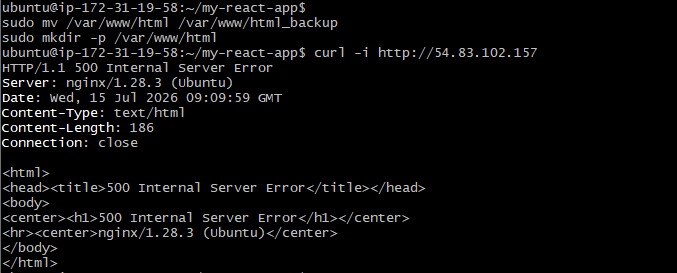

---

#### Screenshot 2 — Output of `curl -I http://<public-ip>` confirming recovery (200 OK)

---

### Notes

Answer the following in your own words:

**1. What caused the application to break in this scenario?**

The application break because the Nginx web root folder /var/www/html was moved, then recreated, but the site was still not serving the React app correctly. In simple terms, Nginx was looking for the files in /var/www/html, but the expected app files were missing there, so Nginx returned a 500 error

---

**2. How did you fix the issue and restore the application?**

It was fixed first by ensuring the old web folder is backed up and creating a fresh /var/www/html folder again. The next step taken was to place the React build files in the correct folder, set the right permissions, and make sure the Nginx config points to that location with root and try_files set properly.

---

**3. What steps would you take to prevent this kind of issue in real production systems?**

In real production systems, avoid moving important web folders unless you are very sure of the path and permissions. Always check the Nginx error log, test the config before restarting, and use a staging server first so mistakes do not affect users

---

# Task 8 — Security & Reliability Review

## Goal

Review and reflect on the security and reliability practices applied during this assignment.

### Security & Reliability Notes

Answer the following in your own words:

**1. Why is SSH key-based authentication more secure than sharing passwords?**

SSH keys are more secure because they use a pair of keys instead of one shared secret. The private key stays on your computer, while the public key goes on the server, so even if someone knows your username, they still cannot log in without the private key. It also reduces the risk of password theft, brute-force attacks, and people reusing the same password in different places

---

**2. Why should only required ports be open on a production server?**

Only opening the ports you really need reduces the attack surface. Every extra open port is another possible way for an attacker to try to reach the server, so closing unused ports helps protect the system. In simple terms, fewer open doors mean fewer chances for trouble.

---

**3. Why is it important for Nginx to be enabled on boot?**

If Nginx is enabled on boot, it starts automatically when the server restarts. That means your website or app comes back online without someone having to log in and start it manually. This is important for reliability because servers can restart after updates, crashes, or power issues.

---

**4. What are the risks of sharing secrets, keys, or credentials publicly?**

Sharing secrets or credentials publicly can let attackers access your server, cloud account, or private data. Once a key or password is exposed, someone else may copy it, use it, or automate attacks with it. The safest rule is to treat passwords, API keys, SSH keys, and tokens like private information that should never be posted in chats, GitHub, screenshots, or blogs.

---

**5. Why should cloud resources be stopped or terminated when they are no longer needed?**

Unused cloud resources waste money and can also create security risk if they stay exposed online. If you are not using a VM, load balancer, disk, or public IP anymore, stopping or deleting it helps reduce cost and lowers the chance of misconfiguration or attack. It also keeps your cloud environment cleaner and easier to manage.

---

# LinkedIn Post (Required)

## Evidence

#### LinkedIn Post URL

Paste your LinkedIn post URL here:

`__________________________`

---

#### Screenshot — Published LinkedIn post

Add your screenshot here.

---

# Submission Instructions

- Add all required screenshots in your submission
- Full name must be visible in required screenshots
- Do not expose sensitive information (keys, passwords, account IDs)

---

# Completion Checklist

- [ ] Task 1: Screenshots (browser, ip a, ss -tulpen, ufw status) + Notes answered
- [ ] Task 2: Screenshots (nginx status, nginx -t, ss port 80) + Notes answered
- [ ] Task 3: Screenshots (access log, error log, journalctl) + Notes answered
- [ ] Task 4: Screenshots (uptime, free -h, df -h, du -sh) + Notes answered
- [ ] Task 5: Screenshots (ls html, grep deployed by, grep try_files) + Notes answered
- [ ] Task 6: Screenshots (nginx -t fail, nginx -t pass, curl recovery) + Notes answered
- [ ] Task 7: Screenshots (curl failure, curl recovery) + Notes answered
- [ ] Task 8: Security & Reliability Notes answered
- [ ] LinkedIn post published and URL submitted
- [ ] Full Name visible in all required screenshots
- [ ] No sensitive data exposed

---

## 📌 About DMI & CloudAdvisory

DevOps Micro Internship (DMI) is a project-based DevOps program run by Pravin Mishra (The CloudAdvisory) focused on real-world execution, systems thinking, and career readiness.

It helps learners build strong DevOps foundations with hands-on experience.

---

## 📌 Resources

- 🌐 DMI Official Website: https://pravinmishra.com/dmi  
- 🎓 DevOps for Beginners (Udemy): https://www.udemy.com/course/devops-for-beginners-docker-k8s-cloud-cicd-4-projects/  
- 🎓 Agentic AI DevOps with Claude Code: https://www.udemy.com/course/ultimate-agentic-ai-devops-with-claude-code/  
- 🎓 DevOps with Claude Code: Terraform, EKS, ArgoCD & Helm: https://www.udemy.com/course/devops-with-claude-code-terraform-eks-argocd-helm/  
- ▶️ YouTube Playlist: https://www.youtube.com/playlist?list=PLFeSNDtI4Cho  
- 🔗 Pravin Mishra (LinkedIn): https://www.linkedin.com/in/pravin-mishra-aws-trainer/  
- 🏢 CloudAdvisory (LinkedIn): https://www.linkedin.com/company/thecloudadvisory/

---

*This submission is part of DevOps Micro Internship (DMI) Cohort 3 — Agentic AI Track.*