# Assignment 5 — Bash Script Automation Drill (OPS Checklist)

Part of the DevOps Micro Internship (DMI) Cohort 3 with Agentic AI

---

## Purpose

In this assignment, you will practice Bash scripting by building a series of small automation scripts covering environment setup, variables, arrays, loops, file conditionals, if-else logic, and functions. These scripts form the foundation of real-world Linux automation used in DevOps, cloud, and production support environments.

---

# Task 1 — Bash Environment & Workspace Setup

## Goal

Verify that Bash is available on your system and create a clean workspace for this assignment.

### Evidence

#### Screenshot 1 — Output of `echo $SHELL` and `bash --version`

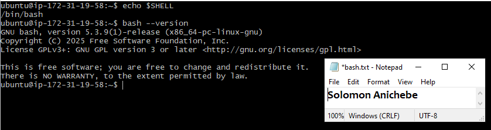

---

#### Screenshot 2 — Output of `pwd` and `ls -lah` showing the scripts directory

---

### Notes

Answer the following in your own words:

**1. What is Bash?**

Bash stands for Bourne Again Shell. It is a command-line shell and scripting language used to enter commands and automate tasks on Linux and other Unix-like systems. Bash reads the commands you type or the commands saved in a script and tells the operating system what to do.

---

**2. What is the difference between shell and Bash?**

A shell is a program that lets you interact with the operating system through commands. Bash is one type of shell. Other shells include sh, zsh, ksh. They all do similar basic jobs, but they may have different features, syntax, and scripting rules.

---

**3. Why is it important to confirm the Bash version before writing scripts?**

Checking the Bash version helps you know whether Bash is installed and helps ensure the script uses commands and syntax supported by the system. This is important because some commands or syntax only work in certain versions. Confirming the version helps make sure your script will run correctly on the target system.

---

# Task 2 — Your First Bash Script

## Goal

Create your first Bash script, make it executable, and run it from the terminal.

### Evidence

#### Screenshot 1 — Content of `first-script.sh`

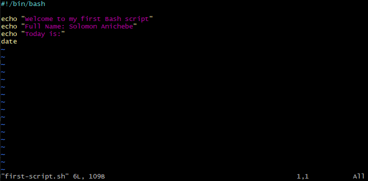

---

#### Screenshot 2 — Output of `./first-script.sh`

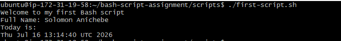

---

#### Screenshot 3 — Output of `ls -l first-script.sh` showing executable permission

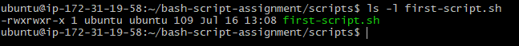

---

### Notes

Answer the following in your own words:

**1. What is the purpose of `#!/bin/bash`?**

#!/bin/bash is called the shebang line. It tells the computer to use Bash to run the script. In simple terms, it says, “run this file with Bash.”

---

**2. Why do we use `chmod +x` before running a script?**

A new script usually cannot be run directly because it does not have execute permission. chmod +x gives the script permission to run, so you can execute as a program directly with ./script.sh.

---

**3. What is the difference between running a script using `./script.sh` and `bash script.sh`?**

When you use "./script.sh", the script runs directly, so it must have execute permission, and the shebang line decides which interpreter is used. When you use "bash script.sh", you are telling Bash to run the script directly, so execute permission is not required, and Bash is used even if the script has a different shebang.

---

# Task 3 — Variables: User Information Script

## Goal

Use variables to store and display user-related information.

### Evidence

#### Screenshot 1 — Content of `user-info.sh`

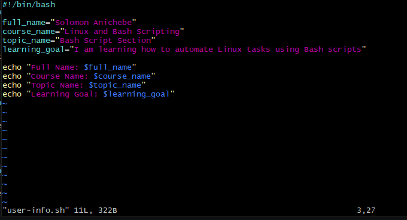

---

#### Screenshot 2 — Output of `./user-info.sh`

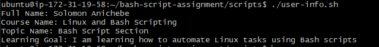

---

### Notes

Answer the following in your own words:

**1. What is a variable in Bash?**

A variable in Bash is a name that stores a value, like text or a number. It helps you save information and use it again later in a script or terminal session and can display it whenever needed.

---

**2. Why should we avoid spaces around the `=` sign when creating variables?**

Bash uses spaces to separate commands and values. So if you write name = john, Bash may read it as a command instead of a variable assignment. The correct way is name=john.

---

**3. How do you access the value stored inside a Bash variable?**

You put a $ before the variable name to get its value. For example, $name or ${name} will show what is stored in the variable name. Type echo "$course_name" to display the output.

---

# Task 4 — Arrays & Loops: Tools Checklist Script

## Goal

Use arrays and loops to print a checklist of tools used in Bash scripting.

### Evidence

#### Screenshot 1 — Content of `tools-checklist.sh`

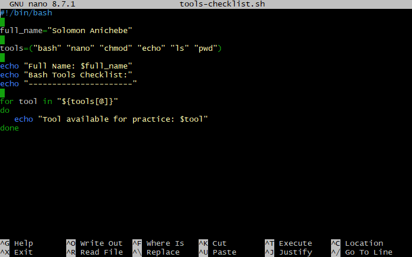

---

#### Screenshot 2 — Output of `./tools-checklist.sh`

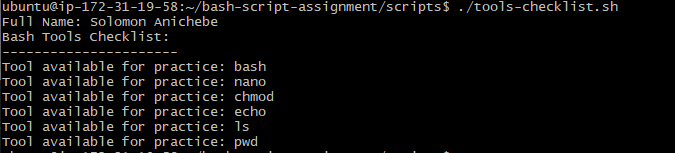

---

### Notes

Answer the following in your own words:

**1. What is an array in Bash?**

An array is a variable that can hold several values(could be a text or number) at once. In this script, the fruits array is used to store many types of fruits in one place. Foe example fruits=("mango" "banana" "orange")

---

**2. Why are arrays useful in scripts?**

Arrays make scripts neater and easier to manage. Instead of creating many separate variables for each fruits, you keep everything in one list and work through it with a loop.

---

**3. What does `"${tools[@]}"` mean?**

It means “all items in the fruits array.” The quotes help Bash treat each item as its own value, even if one item has spaces in it. For example:

fruits=("mango" "banana" "orange")
for fruit in "${fruits[@]}"; do
  echo "$fruit"
done

Meaning lets the loop go through every fruit one by one.

---

**4. What is the purpose of the `for` loop in this script?**

The for loop takes each item from the array one after another and stores it in the loop variable. Then the script can print or use that item before moving to the next one. This example contains four values in the fruits array , and the loop will prints a list of fruits for each name in the list.

fruits=("mango" "banana" "orange" "Pear")
for fruit in "${fruits[@]}"; do
  echo " fruit name: $fruit"
done

---

# Task 5 — Loops: Number Counter Script

## Goal

Use loops to repeat a task multiple times.

### Evidence

#### Screenshot 1 — Content of `counter.sh`

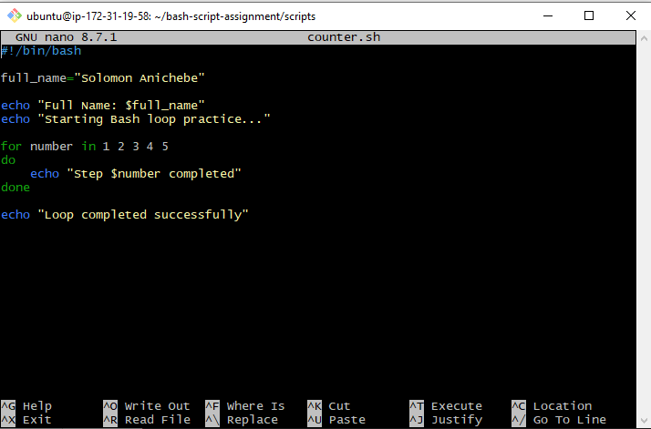

---

#### Screenshot 2 — Output of `./counter.sh`

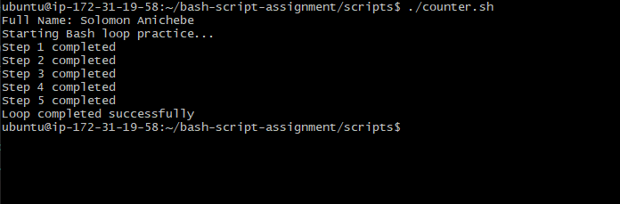

---

### Notes

Answer the following in your own words:

**1. What is a loop?**

A loop is a way to make Bash repeat the same set of commands again and again. It saves you from typing the same thing many times.

---

**2. Why do we use loops in Bash scripting?**

Loops are used to handle repeated work automatically. They make scripts easier to write, shorter, and more efficient

---

**3. How many times did the loop run in your script?**

for i in {1..5}; do
  echo "$i"
done

The loop ran five times because it was given five values (1 2 3 4 5) only.

---

**4. What would you change if you wanted the loop to run 10 times?**

I would extend the list so it includes 10 values instead of 5. For example:

for numbers in 1 2 3 4 5 6 7 8 9 10
do
  echo "Step $numbers completed"
done

---

# Task 6 — Files & Conditionals: File Validation Script

## Goal

Use file checks and conditionals to verify whether files and directories exist.

### Evidence

#### Screenshot 1 — Output of `ls -lah ../test-folder`

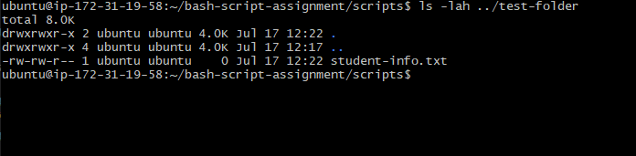

---

#### Screenshot 2 — Content of `file-check.sh`

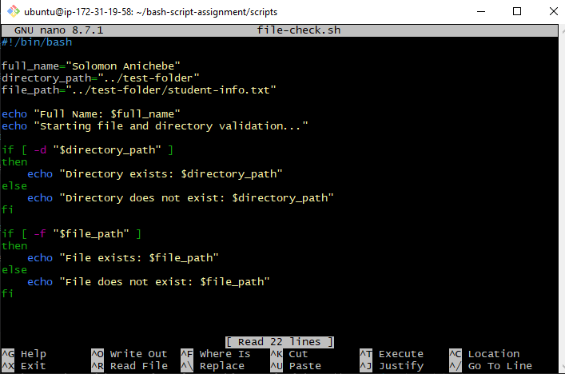

---

#### Screenshot 3 — Output of `./file-check.sh`

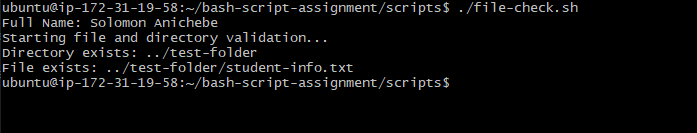

---

### Notes

Answer the following in your own words:

**1. What does `-d` check in Bash?**

-d checks whether a path points to a directory. If the folder exists, the condition is true.

---

**2. What does `-f` check in Bash?**

-f checks whether a path points to a regular file. If the file exists, the condition is true.

---

**3. Why should file and directory paths be stored in variables?**

Using variables makes the script easier to read and update. If the path changes later, you only change it in one place instead of searching through the whole script.

---

**4. What happens if the file does not exist?**

If the file is missing or does not exist, the -f test becomes false, so the script goes to the else part and shows a message like:
File does not exist: ../test-folder/student-info.txt

For example:
folder="../test-folder"
file="../test-folder/student-info.txt"

if [ -d "$folder" ]; then
  echo "Directory exists: $folder"
else
  echo "Directory does not exist: $folder"
fi

if [ -f "$file" ]; then
  echo "File exists: $file"
else
  echo "File does not exist: $file"
fi

---

# Task 7 — Conditionals: Pass or Retry Script

## Goal

Use if-else conditionals to make decisions based on a variable value.

### Evidence

#### Screenshot 1 — Content of `score-check.sh` with `score=85`

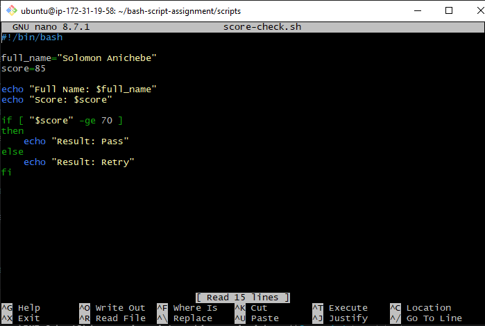

---

#### Screenshot 2 — Output showing `Result: Pass`

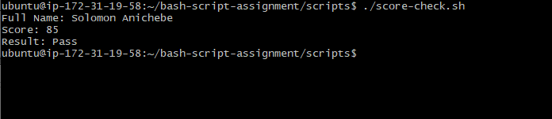

---

#### Screenshot 3 — Content of `score-check.sh` with `score=55`

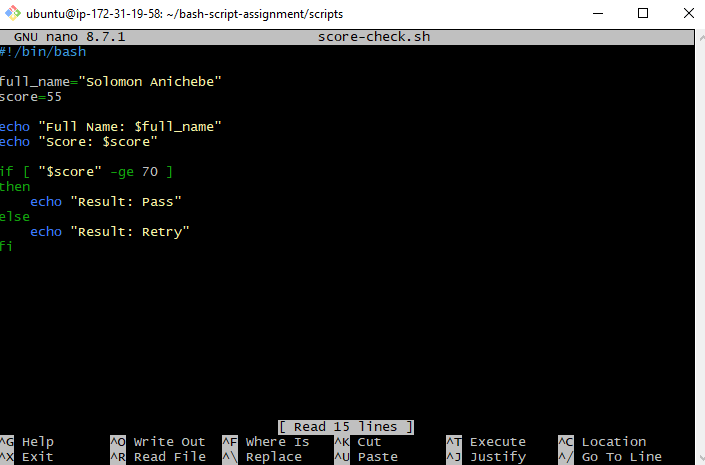

---

#### Screenshot 4 — Output showing `Result: Retry`

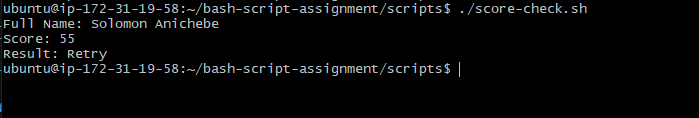

---

### Notes

Answer the following in your own words:

**1. What is the purpose of if-else in Bash?**

if-else helps a Bash script make a decision and to choose between two actions. If the condition is true, the script follows one path. If it is false, it follows another path.

---

**2. What does `-ge` mean?**

-ge means greater than or equal to. It is used to compare numbers. For example, [ "$score" -ge 70 ] checks whether the score is 70 or more.

---

**3. Why should conditions be tested with different values?**

Testing with different values helps you confirm that the script works in all situations. For example, one test can show the pass case, another can show the retry case, and the boundary value like 70 helps confirm the exact cut-off works correctly.

---

**4. How can conditionals help in automation scripts?**

Conditionals make scripts smarter because they can react to what is happening at the moment. A script can check things like whether a service is running, whether a file exists, or whether storage is getting full, then take the right action automatically.

---

# Task 8 — Functions: Final Bash Automation Script

## Goal

Create a final Bash script using functions to organize reusable code.

### Evidence

#### Screenshot 1 — Content of `final-automation.sh`

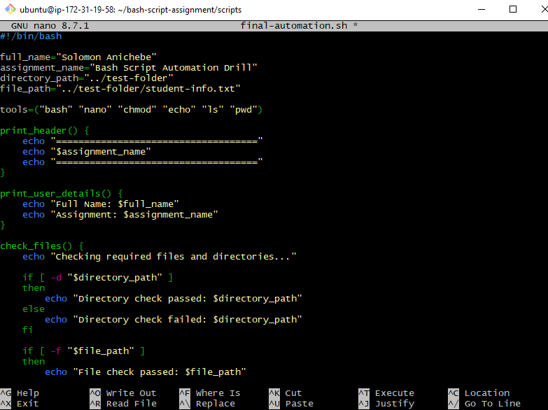

---

#### Screenshot 2 — Output of `./final-automation.sh`

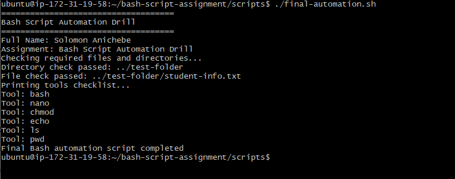

---

#### Screenshot 3 — Output of `ls -lah` showing all created scripts

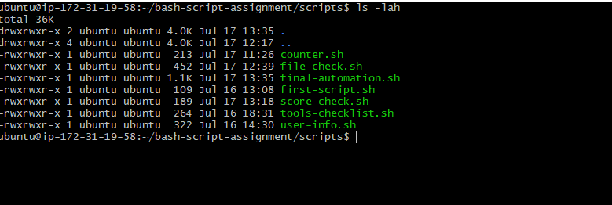

---

### Notes

Answer the following in your own words:

**1. What is a function in Bash?**

A function is a named group of commands that performs one job. After you define it, you can run all the commands inside it just by using the function name.

---

**2. Why are functions useful in scripts?**

Functions help break a big script into smaller, easier parts. This makes the script easier to read, fix, and reuse. If you need the same action again, you can call the function instead of writing the same commands again.

---

**3. Which functions did you create in this script?**

The functions created are 4

- **print_header** prints the assignment title with lines above and below it.

- **print_user_details** — prints your full name and the assignment name.

- **check_files** — checks whether the folder and file exist.

- **print_tools** — loops through the array and prints each tool name.

---

**4. How does this final script combine variables, arrays, loops, conditionals, files, and functions?**

This script brings everything together in one place. It uses variables to store your name, assignment name, folder path, and file path. It uses an array to store the list of tools. The for loop goes through the array one item at a time. The if-else statements with -d and -f check whether the folder and file exist. All of these steps are placed inside functions, which keeps the script neat, organized, and easy to reuse.

---

# LinkedIn Post (Required)

## Evidence

#### LinkedIn Post URL

Paste your LinkedIn post URL here:

`__________________________`

---

#### Screenshot — Published LinkedIn post

Add your screenshot here.

---

# Submission Instructions

- Add all required screenshots in your submission
- Full name must be visible in required screenshots
- All script files must be created and run successfully
- Required notes must be answered clearly for every task
- Do not expose sensitive information (keys, passwords, credentials)

---

# Completion Checklist

- [ ] Task 1: Environment setup verified, workspace created (Screenshots 1–2, Notes answered)
- [ ] Task 2: First script created, executed, permissions verified (Screenshots 1–3, Notes answered)
- [ ] Task 3: Variables script created and run (Screenshots 1–2, Notes answered)
- [ ] Task 4: Arrays and loops script created and run (Screenshots 1–2, Notes answered)
- [ ] Task 5: Counter loop script created and run (Screenshots 1–2, Notes answered)
- [ ] Task 6: File validation script created and run (Screenshots 1–3, Notes answered)
- [ ] Task 7: Pass/Retry conditional script tested with both values (Screenshots 1–4, Notes answered)
- [ ] Task 8: Final automation script created and run (Screenshots 1–3, Notes answered)
- [ ] All scripts run without errors
- [ ] Full Name visible in all required screenshots
- [ ] LinkedIn post published and URL submitted
- [ ] No sensitive data exposed

---

## 📌 About DMI & CloudAdvisory

DevOps Micro Internship (DMI) is a project-based DevOps program run by Pravin Mishra (The CloudAdvisory) focused on real-world execution, systems thinking, and career readiness.

It helps learners build strong DevOps foundations with hands-on experience.

---

## 📌 Resources

- 🌐 DMI Official Website: https://pravinmishra.com/dmi  
- 🎓 DevOps for Beginners (Udemy): https://www.udemy.com/course/devops-for-beginners-docker-k8s-cloud-cicd-4-projects/  
- 🎓 Agentic AI DevOps with Claude Code: https://www.udemy.com/course/ultimate-agentic-ai-devops-with-claude-code/  
- 🎓 DevOps with Claude Code: Terraform, EKS, ArgoCD & Helm: https://www.udemy.com/course/devops-with-claude-code-terraform-eks-argocd-helm/  
- ▶️ YouTube Playlist: https://www.youtube.com/playlist?list=PLFeSNDtI4Cho  
- 🔗 Pravin Mishra (LinkedIn): https://www.linkedin.com/in/pravin-mishra-aws-trainer/  
- 🏢 CloudAdvisory (LinkedIn): https://www.linkedin.com/company/thecloudadvisory/

---

*This submission is part of DevOps Micro Internship (DMI) Cohort 3 — Agentic AI Track.*