# Assignment 6 — Build an AI-Assisted Linux Health Check (AI-Assisted Linux Incident Triage)

Part of the DevOps Micro Internship (DMI) Cohort 3 with Agentic AI

---

## Purpose

In this assignment, you will build a read-only Bash triage script that checks the health of your Ubuntu server and Nginx application, connect it to Claude Code as a reusable `/linux-triage` skill, simulate a controlled Nginx incident, use the skill to gather and analyze evidence, recover the service manually, and verify recovery. The workflow follows the Agentic Loop: Gather → Analyze → Human Act → Verify.

---

# Task 1 — Confirm the Healthy Baseline and Create the Workspace

## Goal

Confirm that Nginx and the React application are healthy before building the automation.

### Evidence

#### Screenshot 1 — Output of `systemctl is-active nginx`, `ss -ltn | grep ':80'`, and `curl -I http://localhost`

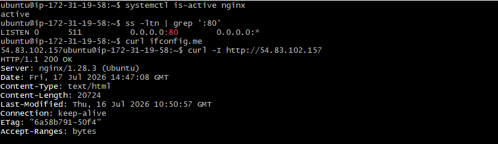

---

#### Screenshot 2 — Output of `pwd` and `find . -maxdepth 4 -type d | sort` showing the workspace folder structure

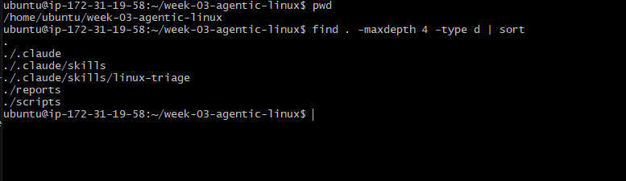

---

### Notes

Answer the following in your own words:

**1. What proves that Nginx is running?**

If systemctl is-active nginx returns active, that means the Nginx service is currently running. This is a strong sign that the web server process has started properly and is working on the machine.

---

**2. What proves that the server is listening for HTTP traffic?**

If ss -ltn | grep ':80' shows port 80, it means the server is listening on the standard HTTP port and can receive HTTP requests. In simple terms, the machine is ready to accept web traffic from browsers or other clients.

---

**3. Why must you capture a healthy baseline before simulating an incident?**

A healthy baseline gives you a normal starting point before anything goes wrong. It helps you compare the working system with the broken one so you can clearly see what changed. After fixing the problem, you can check the system again and confirm that it has returned to the normal healthy state.

---

# Task 2 — Create Project Context and Safety Rules in CLAUDE.md

## Goal

Tell Claude exactly what this project does and what it is not allowed to do.

### Evidence

#### Screenshot 3 — CLAUDE.md open in VS Code showing all four sections (Project Overview, Incident Workflow, Safety Rules, Output Rules)

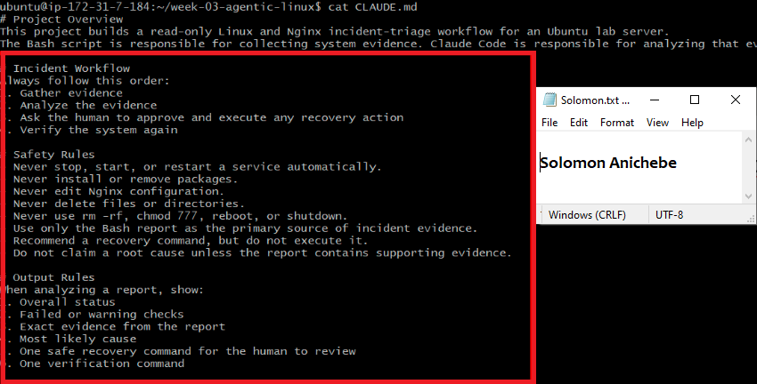

---

### Notes

Answer the following in your own words:

**1. Why should Claude receive project-specific operational rules?**

Claude needs project-specific rules so it knows the purpose of the project, the exact process to follow, and the actions it should avoid. This keeps the response aligned with the incident workflow and reduces the chance of giving advice that does not fit the situation. In practice, these rules help the assistant stay focused, consistent, and safe when handling operational tasks.

---

**2. Why is the human required to execute the recovery command?**

The human has to review the situation and decide whether the recovery command is safe before running it. This adds a layer of control, because the assistant can suggest a fix, but a person should approve any change that affects the server. That way, the recovery step is done with judgment and accountability instead of being applied automatically.

---

**3. Which rule prevents Claude from making an unsupported diagnosis?**

The rule that says not to claim a root cause unless there is supporting evidence stops Claude from guessing. It means the assistant should only explain a cause when the report clearly proves it. This is important because incident analysis should be based on facts, not assumptions.

---

# Task 3 — Use Agentic AI to Plan Before Writing the Script

## Goal

Use Claude Code to inspect the environment and produce a read-only plan before creating any Bash code.

### Evidence

#### Screenshot 4 — Claude Code showing the five-check plan and read-only inspection results

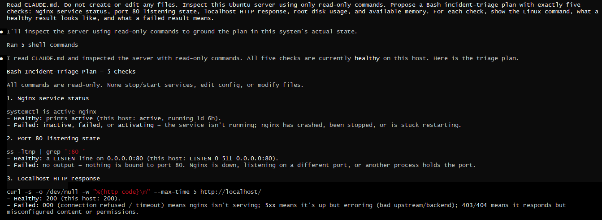
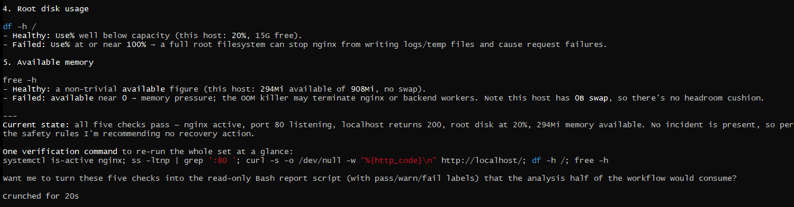

---

### Notes

Answer the following in your own words:

**1. Which part of this task represents the Gather phase?**

The Gather phase is the part where information is collected from the Ubuntu server without making any changes. In this task, that means checking things like whether Nginx is running, whether port 80 is open, what the HTTP response looks like, and whether disk space and memory are healthy. The purpose is to understand the current state of the system before taking any action.

---

**2. Did Claude follow the instruction not to create files? How did you verify this?**

Yes, Claude followed the instruction because it only inspected the system and did not create any new files. I verified that by checking the workspace contents and confirming that no new Bash script or extra file appeared. That shows the task stayed in read-only mode and did not make changes to the environment.

---

**3. Why is planning before coding useful in DevOps automation?**

Planning first helps you think through what the script should do, what it should check, and how each result should be interpreted. It also helps you catch missing steps, risky actions, or logic problems before writing the script. In DevOps, this saves time, reduces mistakes, and makes automation safer and easier to maintain.

---

# Task 4 — Build the Linux Triage Bash Script

## Goal

Create one Bash script that gathers consistent Linux and Nginx health evidence.

### Evidence

#### Screenshot 5 — Top section of `linux-triage.sh` showing variables, thresholds, and the checks array

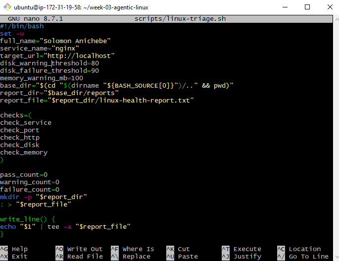

---

#### Screenshot 6 — Middle section showing check functions and conditionals

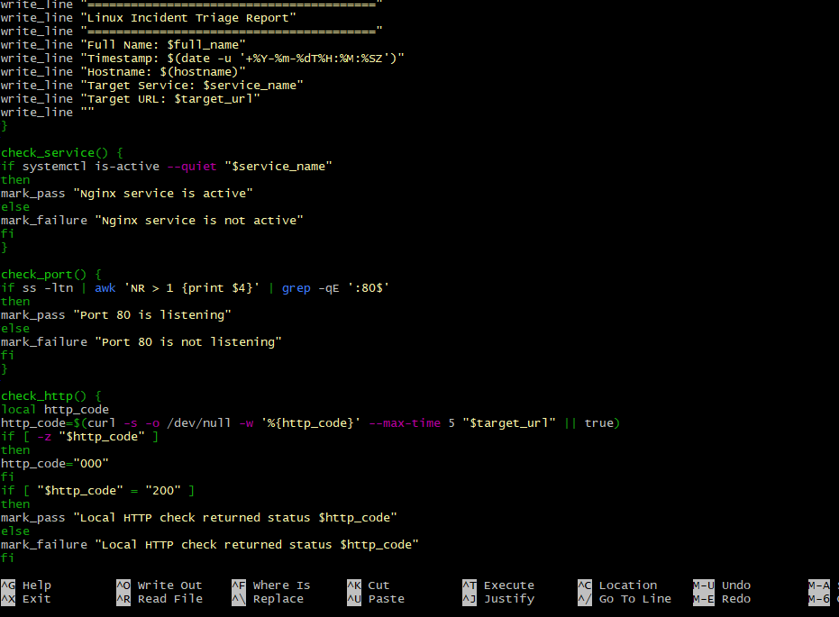

---

#### Screenshot 7 — Bottom section showing the loop, summary function, and exit behavior

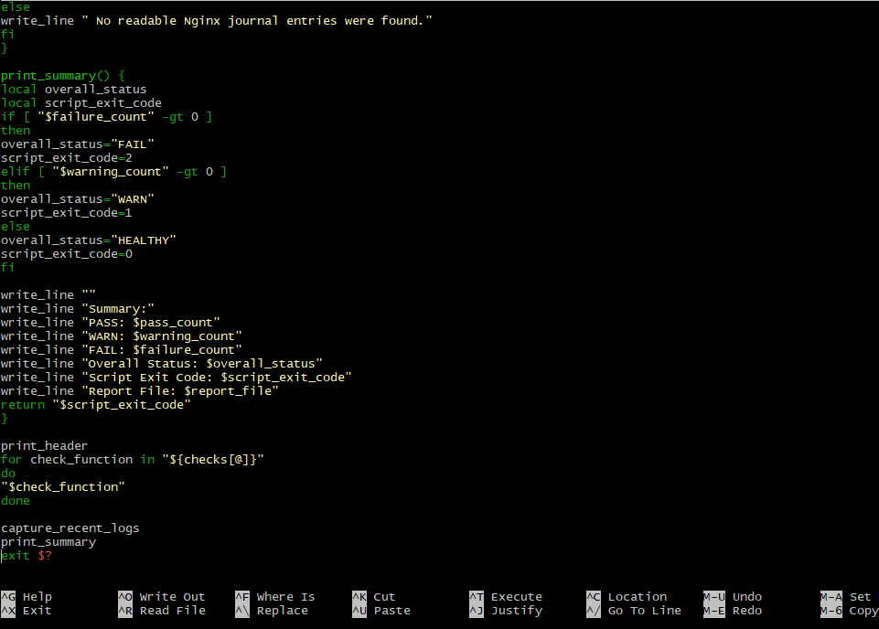

---

#### Screenshot 8 — Output of `bash -n scripts/linux-triage.sh` (no syntax errors) and `ls -l scripts/linux-triage.sh` showing executable permission

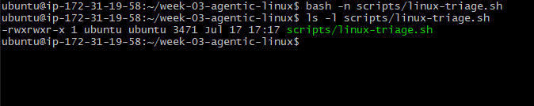

---

### Notes

Answer the following in your own words:

**1. What is stored in the checks array?**

The checks array holds the names of the health-check functions. Each item in the array points to one task, such as checking whether Nginx is running, whether port 80 is open, whether the HTTP response is correct, and whether disk space and memory are okay. Storing them in an array keeps the script organized and makes it easy to manage the checks in one place.

---

**2. How does the `for` loop use that array?**

The for loop goes through the array one item at a time. For each function name, it runs that check in order. This is a neat way to make sure all the health checks are completed without repeating the same code over and over. It also makes the script easier to expand later if more checks are needed.

---

**3. Why are the health checks separated into functions?**

Each function focuses on just one job, which keeps the script clear and easy to understand. If one check needs to be changed or fixed, you can update that single function without touching the others. This structure also makes troubleshooting easier because you can test each part separately.

---

**4. What is the purpose of `$(...)` in this script?**

This $(...) is used to run a command and capture its output so it can be stored in a variable or used in another command. In this script, it helps collect information such as the current time, the server name, the HTTP status, disk usage, memory availability, and recent log data. This makes it possible to build a report from live system details.

---

**5. Why does the script use different exit codes for HEALTHY, WARN, and FAIL?**

Different exit codes give a quick final result for the whole script. 
0 means everything passed, 
1 means there is at least one warning, and 
2 means something failed. 
This is useful because another person or automation system can tell the server status immediately without reading the full report. It also helps monitoring tools react correctly based on how serious the issue is.

---

# Task 5 — Run and Understand the Healthy-State Report

## Goal

Run the Bash script against the healthy server and verify that it creates a report.

### Evidence

#### Screenshot 9 — Output of `./scripts/linux-triage.sh` showing your Full Name and all five check results

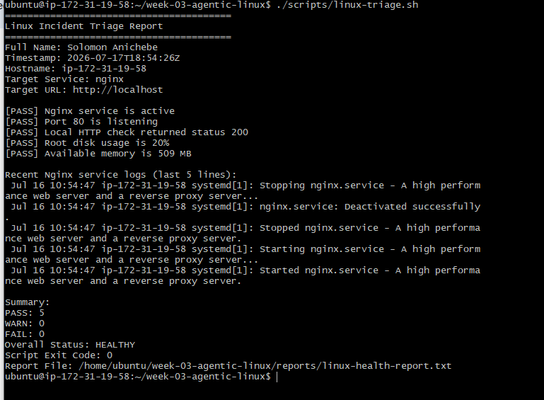

---

#### Screenshot 10 — Output showing the captured exit code and final summary

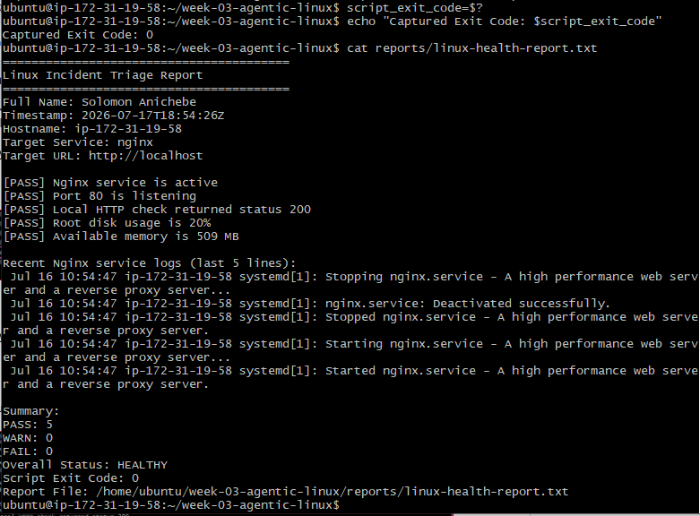

---

### Notes

Answer the following in your own words:

**1. What is the overall status of your healthy baseline?**

The overall status is HEALTHY. That means the system passed all checks, so there is no immediate problem in the baseline report. A healthy baseline is important because it gives you a clean reference point before you simulate an incident.

---

**2. Which exact Linux evidence proves the application is serving traffic?**

Port 80 listening shows that the web server is ready to accept HTTP requests. The HTTP 200 response shows that the application replied successfully, which means traffic is being served normally through the web server.
So in summary, the evidence show that:

Port 80 is listening and Local HTTP check returned status 200

---

**3. Did your script return exit code 0 or 1? Explain why.**

The script returned exit code 0 because every health check passed. Nginx was active, the HTTP port was open, the app returned a good HTTP response, and both disk usage and memory were within safe limits. In Bash, exit code 0 usually means success, while nonzero values signal warnings or errors.

---

**4. What is the difference between a warning and a failure in this script?**

A warning means the system is still working, but something is starting to look risky and should be watched. For example, disk usage between 80 and 90 percent or memory below 100 MB is not an outage yet, but it may become a problem soon. A failure means a key check did not pass, such as Nginx being down, port 80 not listening, the HTTP check failing, or disk usage reaching 90 percent or more.

---

# Task 6 — Create and Run the /linux-triage Skill

## Goal

Turn the Bash script into a reusable, manually invoked Agentic AI workflow.

### Evidence

#### Screenshot 11 — `SKILL.md` showing the frontmatter, allowed tool restrictions, and safety rules

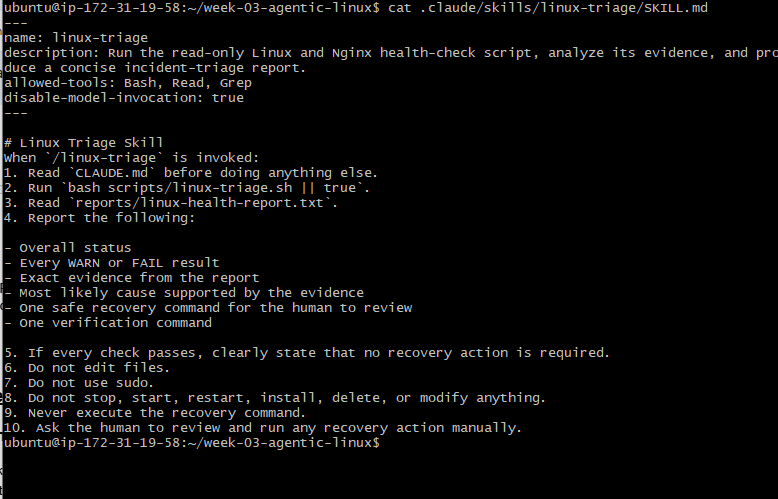

---

#### Screenshot 12 — `/linux-triage` output for the healthy server

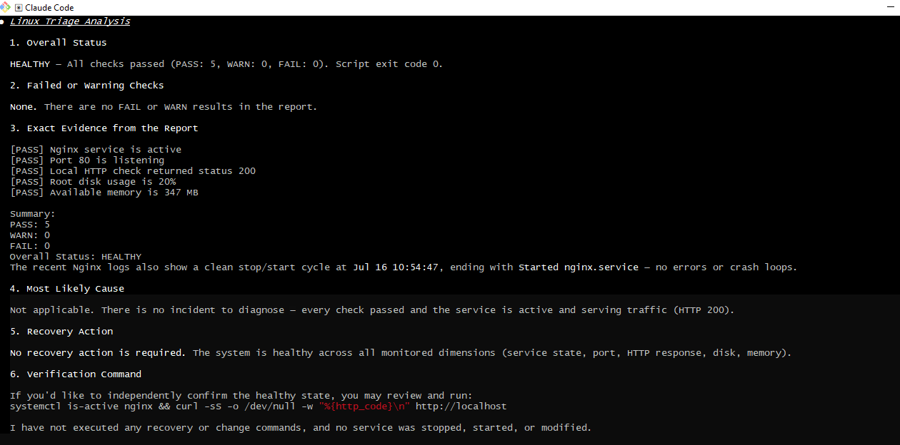

---

### Notes

Answer the following in your own words:

**1. Why does this skill have Bash, Read, and Grep, but not Write?**

This skill is designed to check the server and review the results, not to change files. Bash is needed to run the triage checks, Read is needed to open the generated report, and Grep is needed to find important results like PASS, WARN, or FAIL. Write is not included because the process should stay read-only and avoid making changes to project files.

---

**2. Why is `disable-model-invocation: true` useful for this skill?**

This setting makes sure the skill is not started automatically by the assistant. It forces manual use of the triage command, which gives the user more control over when the server check begins. That is helpful in incident work because it keeps the process deliberate and prevents unwanted actions from happening on its own.

---

**3. What part is performed by Bash, and what part is performed by Claude?**

The Bash script does the inspection work. It checks Nginx, port 80, the HTTP response, disk usage, available memory, and recent logs, then saves the results into a report file. Claude then reads that report, explains what the results mean, points out any warning or failure, and suggests the safest next step. In other words, Bash gathers the facts, and Claude interprets them.

---

**4. Why is this better than asking Claude "Is my server healthy?" without giving it evidence?**

A vague question does not give enough real data to make a good judgment. This approach is better because it first collects live system evidence and then uses that evidence to form the answer. That means the response is based on actual Nginx status, port activity, HTTP response, disk usage, memory, and logs instead of a guess.

---

# Task 7 — Simulate an Nginx Incident and Let the Skill Diagnose It

## Goal

Create a controlled service failure, gather evidence through Bash, and let Claude analyze the evidence without taking recovery action.

### Evidence

#### Screenshot 13 — Output showing Nginx is inactive and the HTTP request fails

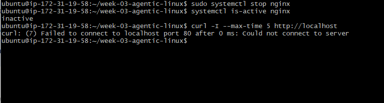

---

#### Screenshot 14 — `/linux-triage` output showing failed evidence, most likely cause, and a suggested recovery command

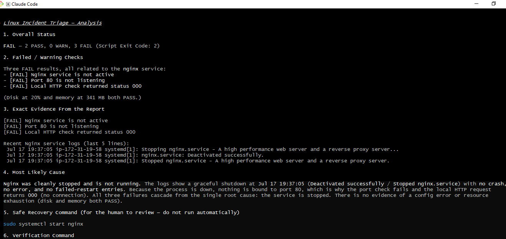

---

#### Screenshot 15 — `incident-failure-report.txt` showing the failed checks and your Full Name

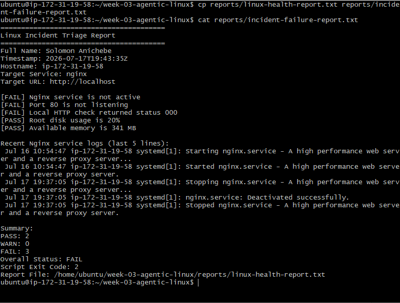

---

### Notes

Answer the following in your own words:

**1. Which three checks failed?**

The failed checks were the Nginx service check, the port 80 check, and the local HTTP check. The disk and memory checks were still fine, so the problem was limited to the web service side. In other words, the server resources were okay, but the web application was not reachable.

---

**2. What evidence supports the conclusion that Nginx is unavailable?**

The report shows three clear signs: Nginx is not active, port 80 is not listening, and the local HTTP request returned 000. When these three results appear together, it usually means the web server is down or not accepting traffic. That also explains why the application cannot respond to browser or client requests.

---

**3. Did Claude execute the recovery command? Why is that important?**

No, Claude did not run the recovery command; it only suggested it. That is important because a person should review the evidence and approve the fix before anything changes on the server. This keeps the incident response safe and prevents automatic actions from making a bad situation worse.

---

**4. Which phase of the Agentic Loop is represented by the Bash report?**

The Bash report represents the Gather phase. This is the stage where the script collects facts from the system, such as service status, open ports, HTTP response, disk usage, memory, and recent logs. It creates the raw evidence needed for analysis.

---

**5. Which phase is represented by Claude's explanation?**

Claude’s explanation represents the Analyze phase. At this stage, the evidence is interpreted, the failed checks are identified, and the likely issue is described. Claude also suggests the next step, but the final recovery action should still be reviewed by a human.

---

# Task 8 — Recover Manually, Verify Again, and Write the Incident Summary

## Goal

Recover the service as the human operator and prove that the system is healthy again.

### Evidence

#### Screenshot 16 — Output showing Nginx is active and `curl -I http://localhost` returns 200 OK

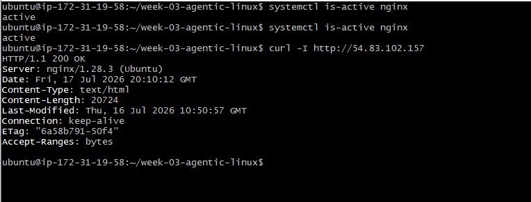

---

#### Screenshot 17 — Second `/linux-triage` output showing successful recovery with no FAIL results

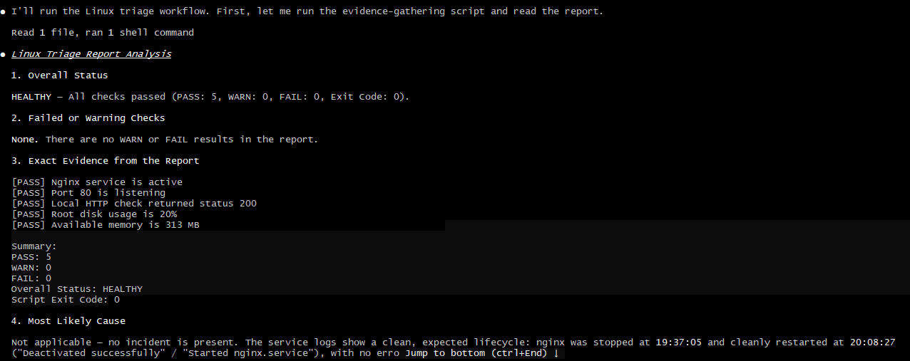
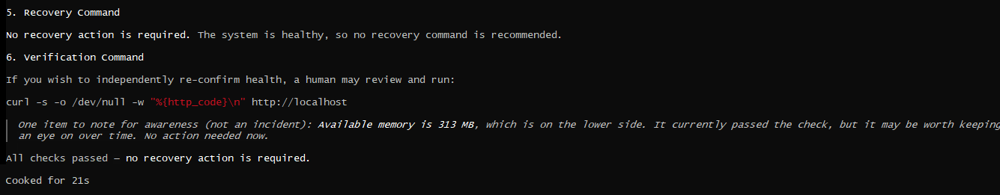

---

#### Screenshot 18 — Output of `ls -lah reports` showing both `incident-failure-report.txt` and `recovery-report.txt`

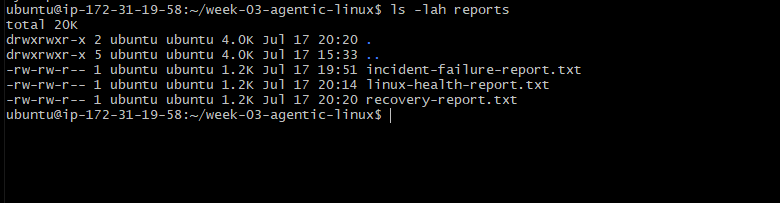

---

#### Screenshot 19 — `incident-summary.md` showing all required sections and your Full Name

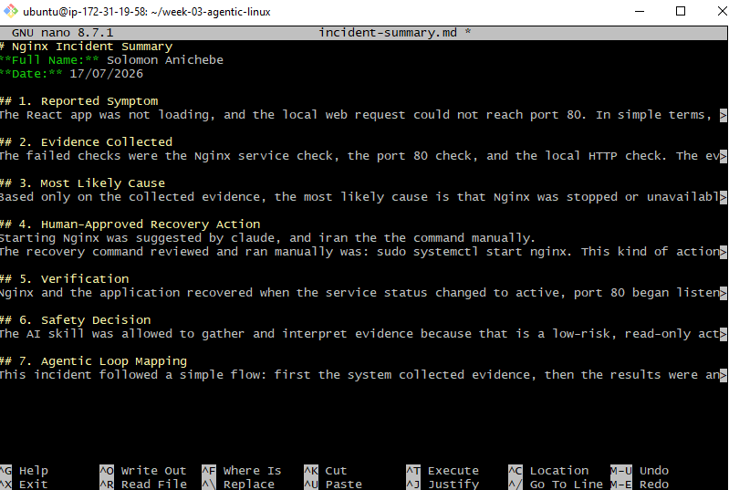

---

### Notes

Answer the following in your own words:

**1. What action did you execute manually?**

I manually ran the command to start the web server:
sudo systemctl start nginx. All this failed; the Nginx service check, HTTP accessibility check, and listening Port 80. These failures indicated that the web server was no longer serving requests.

---

**2. What evidence proves that the service recovered?**

The service is shown as active/running (systemctl status nginx), port 80 is listening (ss/netstat shows a listener on :80), and an HTTP request to localhost returns a successful status (curl http://localhost returns 200). Also,Nginx logs showed a successful startup, confirming that the web server up and serving requests.

---

**3. Why is the second triage run necessary?**

The second triage run verifies the recovery actually worked and checks for related issues (e.g., the service restarted but the app failed to bind, config errors, or dependent services still broken). It confirms the system reached a healthy state rather than only that a restart command completed. 
This final verification shows objective evidence that the issue has been resolved and confirm no further action is required. It represents the Verify phase of the Agentic Loop, ensuring the recovery was successful rather than simply assuming it was.

---

**4. What could go wrong if an AI agent automatically restarted every failed service?**

Automatic restarts of an AI agent can cause cascading failures, it can hide the real problem, cause data loss or corruption, restart at the wrong time (during deployment or backup), and make outages worse by repeatedly restarting a failing service, or break compliance/maintenance rules.

---

**5. In one sentence, explain the difference between using AI as a chatbot and using AI in this agentic workflow.**

A chatbot gives advice and answers questions; whereas an agentic workflow AI actively checks systems, analyzes problems, and suggests or performs operations as part of an automated cycle.

---

# Incident Summary

Fill in all seven sections below in your own words.

**Full Name:** Solomon Anichebe

**Date:** 20/07/2026

---

**1. Reported Symptom**

The React app was not loading, and the local web request could not reach port 80. In simple terms, the site looked offline even though the server itself was still reachable for inspection.

---

**2. Evidence Collected**

The Bash report showed three failed checks:

Nginx service was not active.

Port 80 was not listening.

Local HTTP check returned status 000.

The recent Nginx logs also showed that the service had been stopped and then deactivated successfully. At the same time, the resource checks were fine:

Root disk usage was 65%.

Available memory was 384 MB.

That means the outage was not caused by storage pressure or memory shortage.

---

**3. Most Likely Cause**

Using only the evidence from the report, the most likely cause was that Nginx had been stopped. Because the service was down, port 80 was closed and the local HTTP request could not connect, which prevented the React app from being served.

---

**4. Human-Approved Recovery Action**

Claude suggested starting Nginx, but I carried out the fix myself after checking the report. The command I ran manually was: sudo systemctl start nginx
This matters because service recovery should be approved and executed by a person, not applied automatically.

---

**5. Verification**

After the restart, I confirmed that Nginx was active with systemctl is-active nginx, and it returned active. I also checked the app with curl -I http://localhost, and it returned HTTP/1.1 200 OK. Then I ran the triage again, and the new report showed:

Nginx service is active.

Port 80 is listening.

Local HTTP check returned status 200.

Root disk usage is 65%.

Available memory is 378 MB.

The final result was HEALTHY, with all five checks passing and no warnings or failures.

---

**6. Safety Decision**

The AI skill was allowed to gather evidence and explain what it meant because those actions are read-only and safe. It was not allowed to restart Nginx because changing service state affects the live system and should only happen after human review and approval. That separation helps prevent accidental disruption during incident handling.

---

**7. Agentic Loop Mapping**

This incident followed a clear sequence:

Gather: The Bash script collected evidence about Nginx, port 80, HTTP response, disk usage, memory, and recent logs.

Analyze: Claude reviewed the report, identified the failed checks, and explained that Nginx had been stopped.

Human Act: I reviewed the recommendation and manually ran sudo systemctl start nginx.

Verify: I confirmed Nginx was active, the application returned HTTP 200, and a fresh triage run showed the system was healthy again.

---

# LinkedIn Post (Required)

## Evidence

#### LinkedIn Post URL

Paste your LinkedIn post URL here:

`https://www.linkedin.com/posts/solomonanichebe_devops-linux-nginx-activity-7487408043912151040-QEcK?utm_source=share&utm_medium=member_desktop&rcm=ACoAAAXBpdEBaUln31DVzGUPS7Q7mpZjlUYg8QY`

---

#### Screenshot — Published LinkedIn post

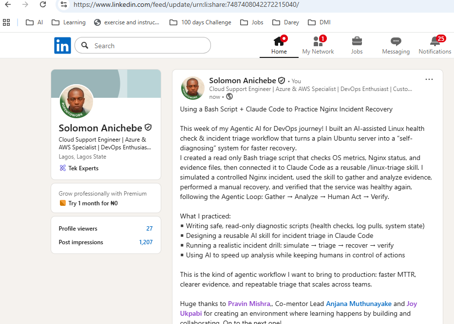

---

# GitHub Repository URL

Paste the URL of your GitHub folder or repository containing the assignment files here:

`https://github.com/nomolos98/devops-micro-internship-pravinmishra.git`

---

# Submission Instructions

- Add all required screenshots in your submission
- Full Name must be visible in required screenshots and the Bash report
- All written answers must be in your own words
- Do not expose sensitive information (keys, passwords, AWS account IDs, tokens)
- GitHub URL must be included in this document

---

# Completion Checklist

- [ ] Task 1: Healthy baseline confirmed, workspace created (Screenshots 1–2, Notes answered)
- [ ] Task 2: CLAUDE.md created with all four sections (Screenshot 3, Notes answered)
- [ ] Task 3: Five-check plan produced by Claude using read-only tools (Screenshot 4, Notes answered)
- [ ] Task 4: `linux-triage.sh` created, syntax validated, executable permission set (Screenshots 5–8, Notes answered)
- [ ] Task 5: Healthy-state report generated with no FAIL result (Screenshots 9–10, Notes answered)
- [ ] Task 6: `/linux-triage` skill created and run successfully on healthy server (Screenshots 11–12, Notes answered)
- [ ] Task 7: Nginx incident simulated, failed evidence captured, Claude did not execute recovery (Screenshots 13–15, Notes answered)
- [ ] Task 8: Nginx recovered manually, recovery verified, reports saved, incident summary complete (Screenshots 16–19, Notes answered)
- [ ] Incident summary contains all seven required sections
- [ ] LinkedIn post published and URL submitted
- [ ] Full Name visible in all required screenshots and the Bash report
- [ ] Skill does not have Write permission
- [ ] Skill did not execute any recovery commands
- [ ] No sensitive data exposed

---

## 📌 About DMI & CloudAdvisory

DevOps Micro Internship (DMI) is a project-based DevOps program run by Pravin Mishra (The CloudAdvisory) focused on real-world execution, systems thinking, and career readiness.

It helps learners build strong DevOps foundations with hands-on experience.

---

## 📌 Resources

- 🌐 DMI Official Website: https://pravinmishra.com/dmi  
- 🎓 DevOps for Beginners (Udemy): https://www.udemy.com/course/devops-for-beginners-docker-k8s-cloud-cicd-4-projects/  
- 🎓 Agentic AI DevOps with Claude Code: https://www.udemy.com/course/ultimate-agentic-ai-devops-with-claude-code/  
- 🎓 DevOps with Claude Code: Terraform, EKS, ArgoCD & Helm: https://www.udemy.com/course/devops-with-claude-code-terraform-eks-argocd-helm/  
- ▶️ YouTube Playlist: https://www.youtube.com/playlist?list=PLFeSNDtI4Cho  
- 🔗 Pravin Mishra (LinkedIn): https://www.linkedin.com/in/pravin-mishra-aws-trainer/  
- 🏢 CloudAdvisory (LinkedIn): https://www.linkedin.com/company/thecloudadvisory/

---

*This submission is part of DevOps Micro Internship (DMI) Cohort 3 — Agentic AI Track.*