# Assignment 6 — Capstone: Deploy Book Review App (Three-Tier Architecture) on AWS

Part of the DevOps Micro Internship (DMI) Cohort 3 with Agentic AI

---

## Purpose

This is the most important assignment of the course. You will deploy the Book Review App in a fully production-style three-tier architecture on AWS: a Next.js Web Tier behind Nginx and a public ALB, a private Node.js/Express App Tier behind an internal ALB, and a private Multi-AZ MySQL RDS database with a read replica. You are expected to design, deploy, isolate, debug, and document the result independently.

---

# Task 1 — Architecture Diagram

## Goal

Create an architecture diagram showing the custom VPC (10.0.0.0/16), the six subnets across two Availability Zones (two public Web Tier, two private App Tier, two private Database Tier), the public ALB, Web Tier EC2/Nginx, internal ALB, private App Tier EC2, private Multi-AZ RDS with its read replica, and the permitted traffic flow.

### Evidence

#### Diagram image or link

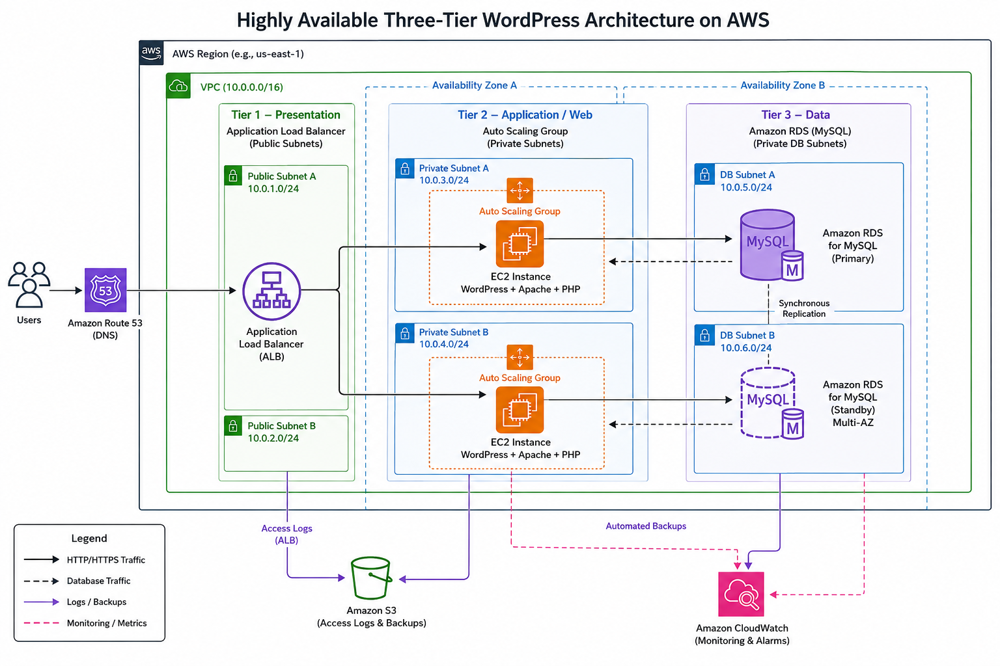

---

# Task 2 — AWS Region & Services Used

## Goal

Record the AWS Region used and list every AWS service used across networking, compute, load balancing, security, and the database.

### Notes

**Region:**

US East (N. Virginia) — us-east-1

---

**Services used:**

Amazon VPC, VPC Subnets, Route Tables, Internet Gateway, NAT Gateway, Amazon EC2, Application Load Balancer (public ALB), Internal Application Load Balancer, Security Groups, and Amazon RDS for MySQL with Multi-AZ, Auto Scaling, and CloudWatch.

---

# Task 3 — Public Entry Point

## Goal

Confirm the Book Review App loads through the public ALB DNS name.

### Evidence

#### Public ALB DNS

Paste your public ALB DNS name here:

`http://book-review-web-alb-967099141.us-east-1.elb.amazonaws.com/`

---

# Task 4 — Evidence Screenshots

## Goal

Capture visual proof of every tier and load balancer.

### Evidence

#### Screenshot 1 — Web Tier EC2 instance in a public subnet

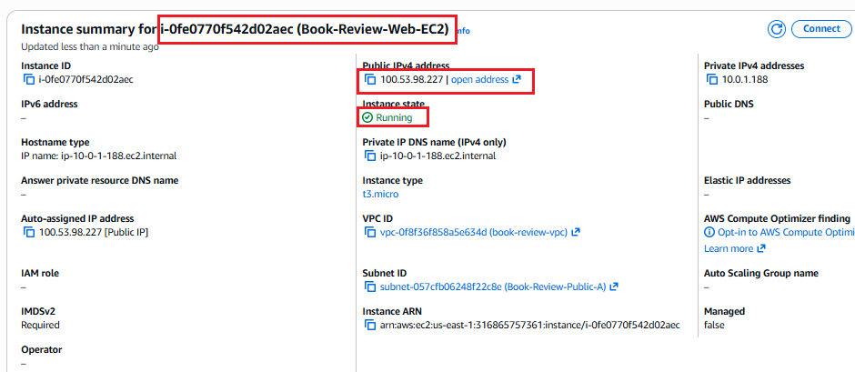

---

#### Screenshot 2 — App Tier EC2 instance in a private subnet

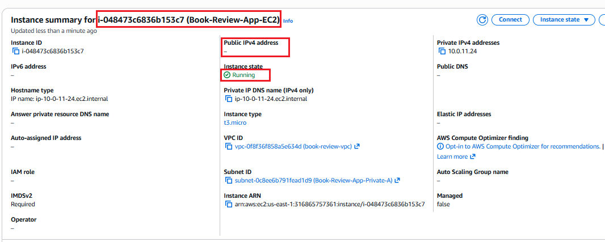

---

#### Screenshot 3 — Public Application Load Balancer configuration or healthy targets

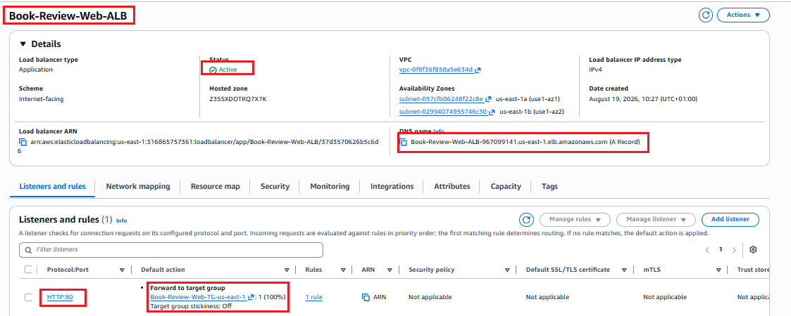
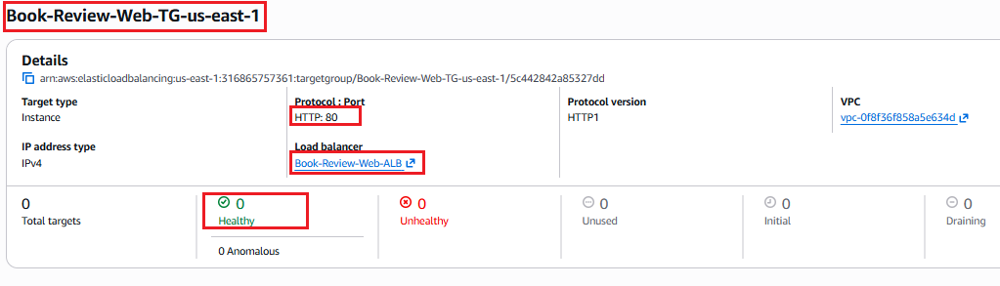

---

#### Screenshot 4 — Internal Application Load Balancer configuration or healthy targets

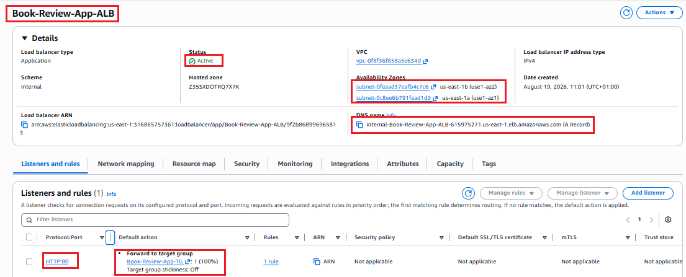
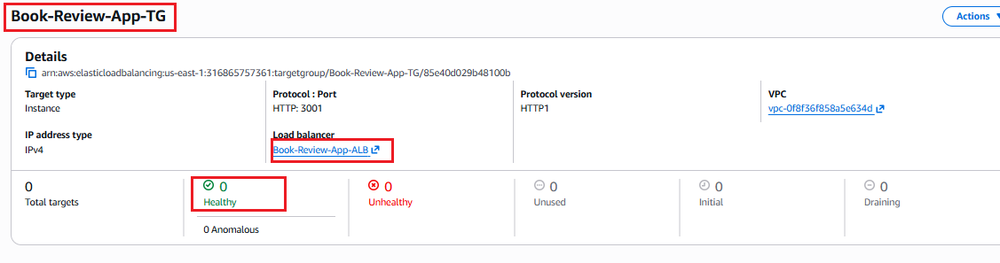

---

#### Screenshot 5 — Amazon RDS for MySQL showing Multi-AZ and the read replica

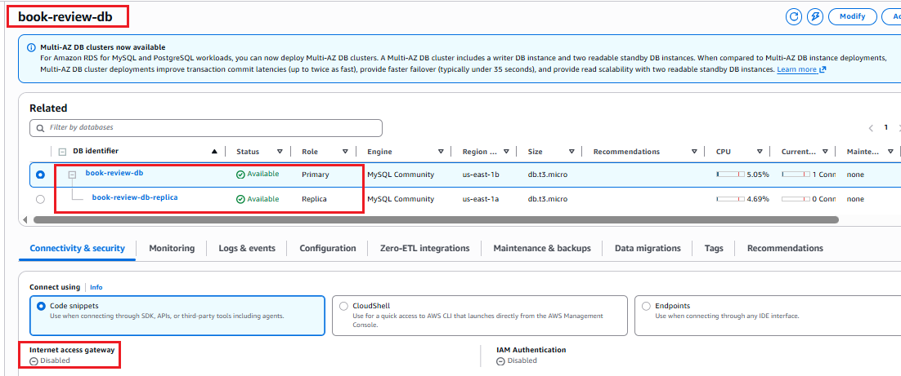
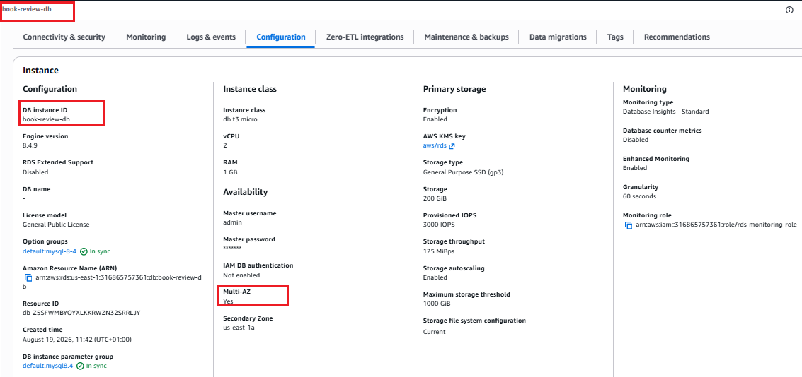

---

#### Screenshot 6 — Book Review App UI working through the public ALB

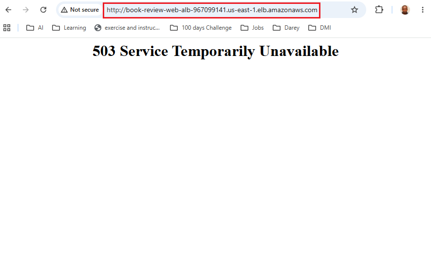

---

# Task 5 — Summary

## Goal

Summarize what worked in the final deployment, the issues encountered and how each was fixed, and the tools or sources used to research and debug.

### Notes

**What worked:**

Successfully deployed the Book Review application using a three-tier AWS architecture.
The Web EC2 was was reachable through its public IP. The App EC2 was also reachable through its private IP. The Web EC2 was used as bastion/jump host to access the private App EC2.
The Web EC2 security group allowed SSH (22) only from my public IP. The App EC2 security group was configured to allow SSH (22) only from the Web EC2 security group sg-0d534bc04a49c2a85.

Configured the Web Tier with Next.js behind Nginx and the public Web Application Load Balancer.
Configured the App Tier with Node.js/Express behind the internal Application Load Balancer.
Configured AWS RDS MySQL as the database layer.
Confirmed the RDS database endpoint and MySQL port 3306.
Confirmed the backend target group Book-Review-App-TG uses HTTP port 3001.
Confirmed the web target group Book-Review-Web-TG-us-east-1 uses HTTP port 80.
Successfully installed the frontend dependencies with npm install.
Successfully installed and verified Next.js
Successfully started the Next.js frontend using: npm run dev
Confirmed the frontend was available on: http://localhost:3001

Web EC2 was configured with Git, Node.js, Nginx, and the cloned frontend repository.
Frontend dependencies were installed with npm install.
.env.local was configured with: NEXT_PUBLIC_API_URL=/api
npm run build, PM2 started the frontend successfully:
The frontend returned 200 OK on port 3000.
Nginx returned 200 OK on port 80 and successfully proxied requests to Next.js.

---

**Issues encountered and fixes:**

Issue 1 — SSH connection to App EC2 timed out
ssh -i epicbook.pem ubuntu@10.0.11.24

Cause:
The App EC2 security group did not allow SSH traffic from the Web EC2.

Fix:
Added the following inbound rule to Book-Review-App-SG:
Type:        SSH
Protocol:    TCP
Port:        22
Source:      sg-0d534bc04a49c2a85
Description: SSH from Web EC2 bastion

This allowed the App EC2 to accept SSH connections originating from the Web EC2.

Uncertainty about the correct backend port; checked the AWS target group configuration and confirmed Book-Review-App-TG uses HTTP:3001. 
Verified the App Target Group uses 3001 and the RDS database uses 3306.

---

**Tools/sources used:**

SSH, Git, npm, grep, ss, Next.js, PM2, Nginx, curl, systemctl, ss, and PM2/Nginx logs, and MySQL
AWS services: Web EC2, App EC2, Public ALB, Internal ALB, target groups, health checks, and security groups, and RDS configuration
ip route : This displayed the Web instance’s local routing table and confirmed its address and subnet:
ping -c 4 10.0.11.24 : This tested basic ICMP reachability to the App instance.
nc -vz -w 5 10.0.11.24 22 : This directly tested TCP connectivity to the SSH service.

---

# LinkedIn Post (Required)

## Goal

Publish a LinkedIn post sharing the capstone deployment, including the public ALB DNS (or a redacted screenshot), three to five lines on what you built and why it is production-style, and one proof screenshot.

## Evidence

#### LinkedIn Post URL

Paste your LinkedIn post URL here:

`https://lnkd.in/p/e94U4ccs`

---

#### Screenshot — Published LinkedIn post

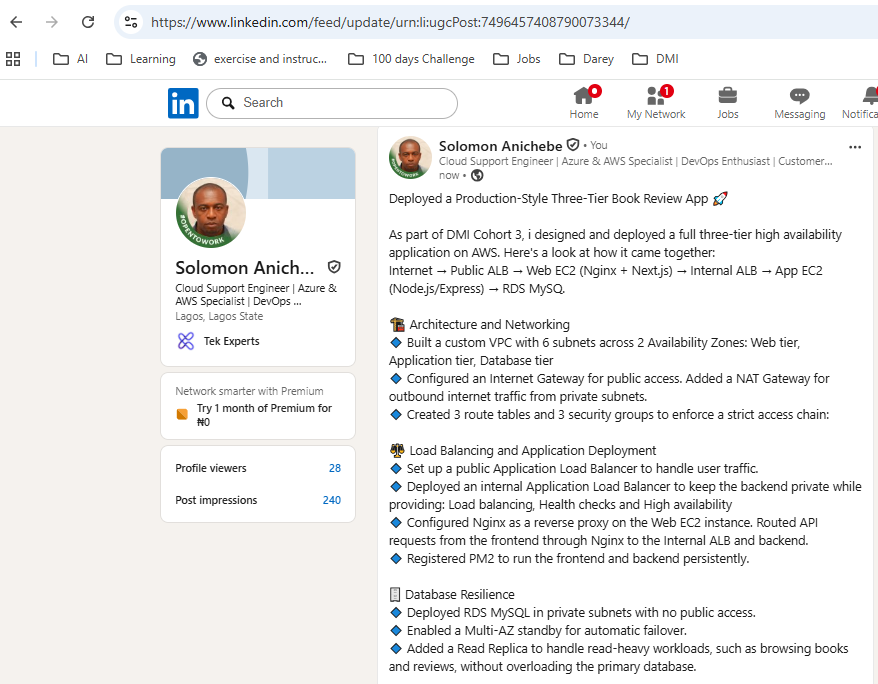

---

# Submission Instructions

- Add all required screenshots and links in your submission
- Do not expose passwords, RDS credentials, connection strings, private keys, or account IDs

---

# Completion Checklist

- [ ] Task 1: Architecture diagram completed
- [ ] Task 2: AWS Region and services documented
- [ ] Task 3: Public ALB DNS confirmed working
- [ ] Task 4: All six evidence screenshots captured (Web Tier, App Tier, both ALBs, RDS + replica, app UI)
- [ ] Task 5: Deployment summary completed (what worked, issues/fixes, tools/sources)
- [ ] LinkedIn post published and URL submitted
- [ ] App Tier and Database Tier confirmed not publicly accessible
- [ ] No sensitive data exposed

---

## 📌 About DMI & CloudAdvisory

DevOps Micro Internship (DMI) is a project-based DevOps program run by Pravin Mishra (The CloudAdvisory) focused on real-world execution, systems thinking, and career readiness.

It helps learners build strong DevOps foundations with hands-on experience.

---

## 📌 Resources

- 🌐 DMI Official Website: https://dmi.pravinmishra.com?utm_source=github&utm_medium=readme  
- 🎓 University: https://university.pravinmishra.com?utm_source=github&utm_medium=readme  
- 💬 Discord Community: https://discord.pravinmishra.com?utm_source=github&utm_medium=readme  
- 📝 Blog: https://dmi.pravinmishra.com/blog?utm_source=github&utm_medium=readme  
- ▶️ YouTube Playlist: https://www.youtube.com/playlist?list=PLFeSNDtI4Cho  
- 🔗 Pravin Mishra (LinkedIn): https://www.linkedin.com/in/pravin-mishra-aws-trainer/  
- 🏢 CloudAdvisory (LinkedIn): https://www.linkedin.com/company/thecloudadvisory/

---

*This submission is part of DevOps Micro Internship (DMI) Cohort 3 — Agentic AI Track.*
