# Assignment 7 — AI-Assisted AWS Security and Cost Audit

Part of the DevOps Micro Internship (DMI) Cohort 3 with Agentic AI

---

## Purpose

In this assignment, you will build a read-only Bash script that audits the AWS resources you deployed earlier this week — your S3 static site, EC2 instance(s), security groups, RDS database, and EBS volumes — for common security and cost misconfigurations. You will then connect that script to Claude Code as a reusable `/aws-audit` skill that explains what it found and recommends a fix, without ever making the fix itself. Finally, you will find a real misconfiguration in your own account, apply the fix yourself, and prove it worked with a second audit run.

---

# Task 1 — Confirm Your AWS Resources and Set Up Your Workspace

## Goal

Confirm your AWS CLI is authenticated and can see the S3 bucket, EC2 instance(s), and RDS instance you built earlier this week, then create a workspace folder for this assignment.

### Evidence

#### Screenshot 1 — Terminal showing your AWS identity and your S3, EC2, and RDS resources listed

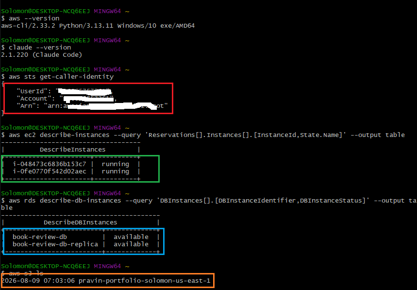

---

# Task 2 — Define Safety Rules in CLAUDE.md

## Goal

Create a `CLAUDE.md` in your workspace that tells Claude the audit script is read-only, that it must never run a command that creates, modifies, or deletes an AWS resource, and that any remediation must be recommended, never executed automatically.

### Evidence

#### Screenshot 2 — `CLAUDE.md` open showing the project overview and safety rules

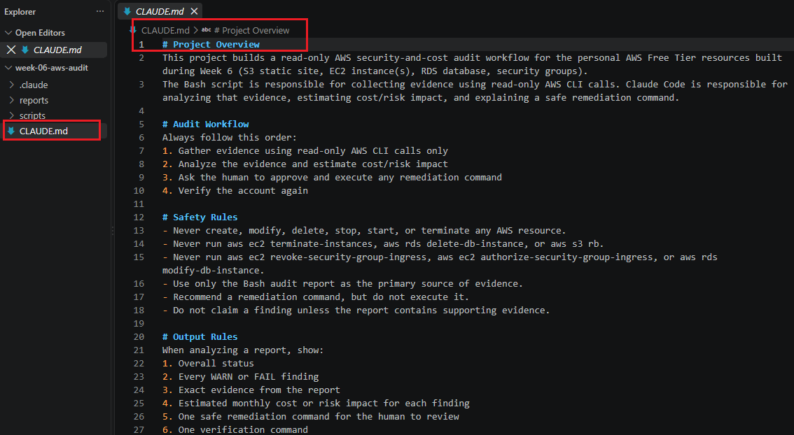

---

# Task 3 — Plan the Audit with Claude Code

## Goal

Ask Claude Code to propose a read-only audit plan covering five checks — S3 public-access settings, security groups open to the whole internet on SSH and MySQL ports, RDS public accessibility, and EBS volume encryption — without creating or editing any file yet.

### Evidence

#### Screenshot 3 — Claude's proposed five-check audit plan

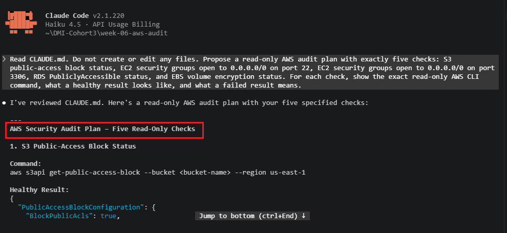

---

# Task 4 — Build the AWS Audit Script

## Goal

Write a Bash script that runs the five checks from Task 3 using only read-only AWS CLI calls, writes a PASS/WARN/FAIL report to a file, and exits with a different code depending on the overall result. Make it executable and confirm it has no syntax errors.

### Evidence

#### Screenshot 4 — The script open in your editor, showing the checks and the report logic


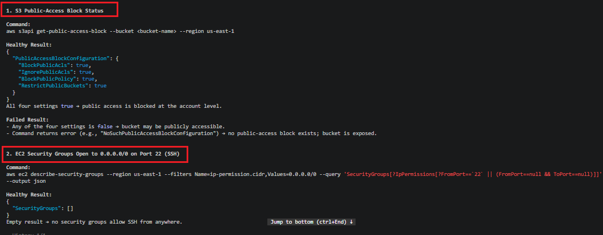

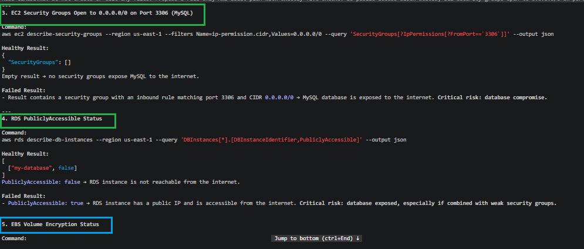
---

# Task 5 — Run the Baseline Audit

## Goal

Run the script against your live AWS account and review the report honestly, noting any PASS, WARN, or FAIL result before you change anything.

### Evidence

#### Screenshot 5 — Script output showing your Full Name and all five check results

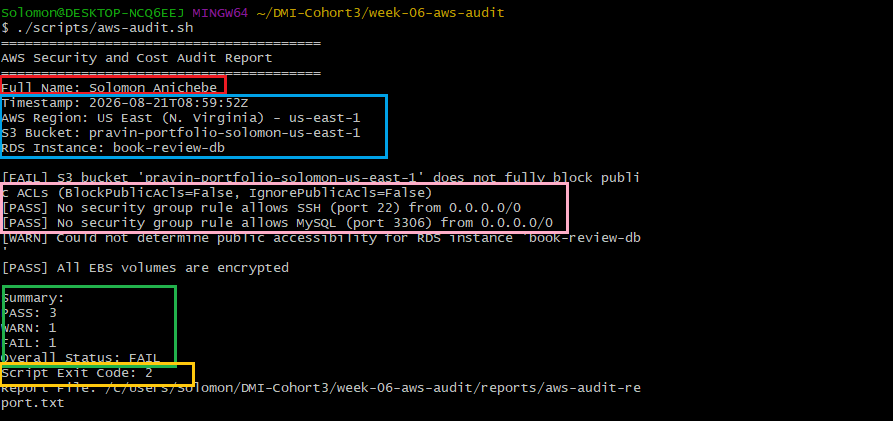

---

# Task 6 — Build and Run the /aws-audit Skill

## Goal

Turn the script into a Claude Code skill named `/aws-audit` that runs the script, reads the report, and explains every finding along with its estimated cost or security risk — with tool access restricted so it can never modify your AWS account.

### Evidence

#### Screenshot 6 — Skill file showing the restricted tool access

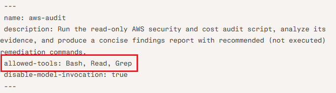

The /aws-audit is restricted to only these tools: allowed-tools: Bash, Read, Grep

---

#### Screenshot 7 — `/aws-audit` output showing the findings and Claude's recommendation

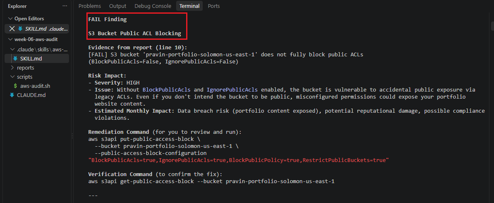

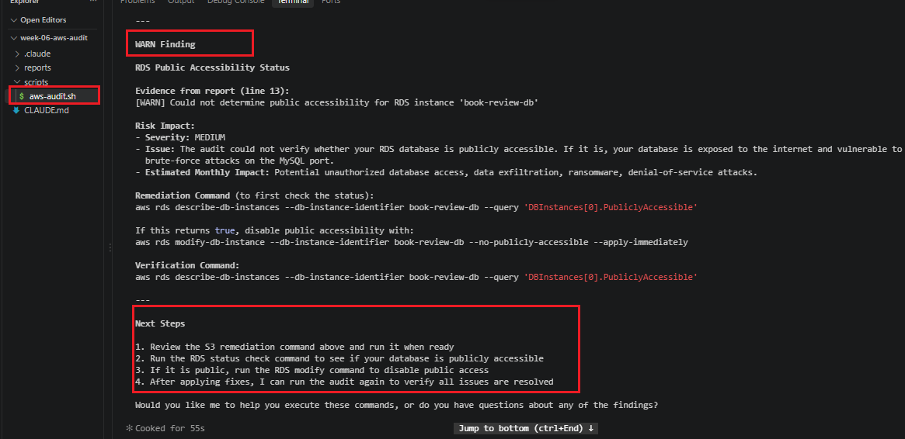

---

# Task 7 — Fix a Real Finding and Re-Verify

## Goal

Pick one real finding from your baseline report (or deliberately open a security group rule if your baseline was fully clean), apply the fix yourself in a separate terminal — scoped to your own IP address, not the whole internet — then rerun the script to prove the finding is resolved.

### Evidence

#### Screenshot 8 — Terminal output of the remediation command you ran yourself

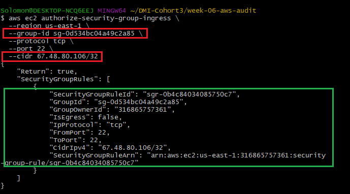

This command create an inbound SSH rule that permits port 22 only from my current public IPv4 address using the /32 CIDR range.

---

#### Screenshot 9 — Second script run showing the finding now passing

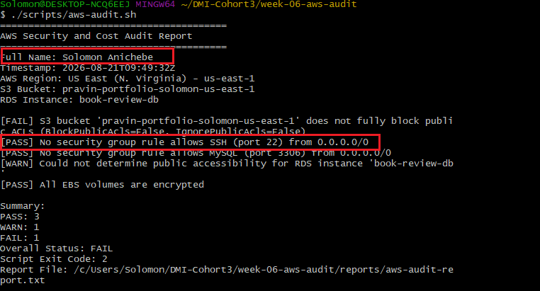

The second audit confirmed that SSH is not exposed to the entire internet. This verifies that the SSH-open-to-the-world check is passing after the remediation.

---

### Notes

Map this assignment to Gather → Analyze → Human Act → Verify: which step did the script perform, which did Claude perform, and why must the remediation command always be run by you and never by Claude?

## Gather → Analyze → Human Act → Verify

This assignment follows a **Gather → Analyze → Human Act → Verify** security workflow.

**Gather:** The Bash audit script, `scripts/aws-audit.sh`, performed the evidence gathering. It used read-only AWS CLI commands to check S3 public-access controls, SSH port 22 exposure, MySQL port 3306 exposure, RDS public accessibility, and EBS encryption. It saved the results in `reports/aws-audit-report.txt`.

**Analyze:** Claude Code performed the analysis through the `/aws-audit` skill. It read `CLAUDE.md`, ran the audit script, reviewed the report, identified the S3 failure and RDS warning, explained the security risks, and recommended remediation and verification commands.

**Human Act:** I reviewed and manually ran the AWS CLI command to allow SSH only from my current public IP address using a `/32` CIDR rule.

**Verify:** I reran `./scripts/aws-audit.sh` and checked the updated report. The SSH finding showed:

```text
[PASS] No security group rule allows SSH (port 22) from 0.0.0.0/0
```

The remediation command must be run by me, not Claude, because it changes real AWS resources. Commands such as `aws ec2 authorize-security-group-ingress`, `aws ec2 revoke-security-group-ingress`, and `aws s3api put-public-access-block` can affect network access, security, application availability, and cost.

Claude is limited to gathering evidence, analyzing results, and recommending commands. A human must review the exact command, confirm its impact, and intentionally apply the change. This reduces the risk of accidental exposure, loss of EC2 access, unintended downtime, or incorrect changes to AWS resources.

---

# Submission Instructions

Complete all tasks in sequence.

Your submission must include:
- All 9 required screenshots

---

# Completion Checklist

- [ ] Task 1: AWS resources confirmed and workspace created (Screenshot 1)
- [ ] Task 2: `CLAUDE.md` created with safety rules (Screenshot 2)
- [ ] Task 3: Claude proposed a read-only five-check audit plan (Screenshot 3)
- [ ] Task 4: Audit script built, executable, and syntax-checked (Screenshot 4)
- [ ] Task 5: Baseline audit run and reviewed honestly (Screenshot 5)
- [ ] Task 6: `/aws-audit` skill built and run, with no `Write` access (Screenshots 6–7)
- [ ] Task 7: A real finding fixed by hand and re-verified as passing (Screenshots 8–9)
- [ ] Gather → Analyze → Human Act → Verify reflection completed (Notes)
- [ ] No AWS credentials or unblurred account IDs exposed

---

## 📌 About DMI & CloudAdvisory

DevOps Micro Internship (DMI) is a project-based DevOps program run by Pravin Mishra (The CloudAdvisory) focused on real-world execution, systems thinking, and career readiness.

It helps learners build strong DevOps foundations with hands-on experience.

---

## 📌 Resources

- 🌐 DMI Official Website: https://dmi.pravinmishra.com?utm_source=github&utm_medium=readme  
- 🎓 University: https://university.pravinmishra.com?utm_source=github&utm_medium=readme  
- 💬 Discord Community: https://discord.pravinmishra.com?utm_source=github&utm_medium=readme  
- 📝 Blog: https://dmi.pravinmishra.com/blog?utm_source=github&utm_medium=readme  
- ▶️ YouTube Playlist: https://www.youtube.com/playlist?list=PLFeSNDtI4Cho  
- 🔗 Pravin Mishra (LinkedIn): https://www.linkedin.com/in/pravin-mishra-aws-trainer/  
- 🏢 CloudAdvisory (LinkedIn): https://www.linkedin.com/company/thecloudadvisory/

---

*This submission is part of DevOps Micro Internship (DMI) Cohort 3 — Agentic AI Track.*
