# Assignment 5 — Deploy EpicBook Web App on Azure VM with Azure Database for MySQL

Part of the DevOps Micro Internship (DMI) Cohort 3 with Agentic AI

---

## Purpose

In this assignment, you will deploy the EpicBook web application on Azure using an Ubuntu Virtual Machine to host the frontend and backend, and Azure Database for MySQL Flexible Server (private access) to store user and product data. You will build the network, provision the resources, deploy the application, and prove that the complete user flow works through the VM's public IP.

---

# Task 1 — Create Network Infrastructure

## Goal

Create a VNet (10.0.0.0/16) with a public subnet (10.0.1.0/24) for the VM and a private subnet (10.0.2.0/24) for MySQL, with NSGs allowing HTTP (80)/SSH (22) publicly and MySQL (3306) only from the VM subnet, plus a Public IP and Network Interface for the VM.

### Evidence

#### Screenshot 1 — Virtual Network overview showing the 10.0.0.0/16 address space and both subnets

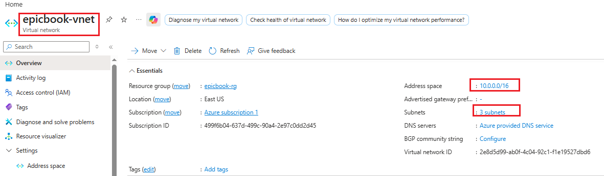

---

#### Screenshot 2 — Public and private NSG inbound rules showing ports 80, 22, and restricted 3306 access

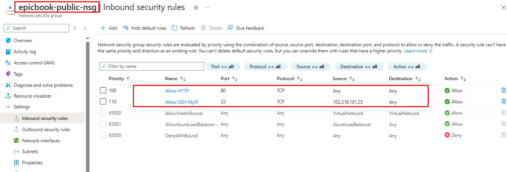

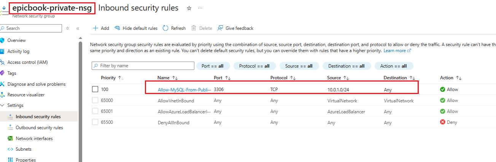

---

#### Screenshot 3 — Public IP and Network Interface association for the Virtual Machine

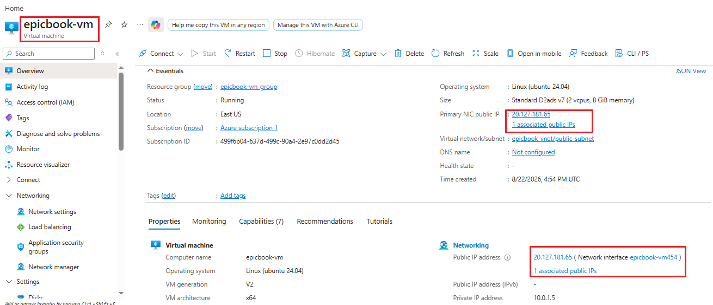

---

# Task 2 — Provision Azure Virtual Machine

## Goal

Launch an Ubuntu 22.04 LTS VM (Standard B1s or equivalent) in the public subnet, and install Node.js, npm, Nginx, Git, and MySQL Client.

### Evidence

#### Screenshot 4 — Virtual Machine overview showing Ubuntu, size, public IP, and subnet

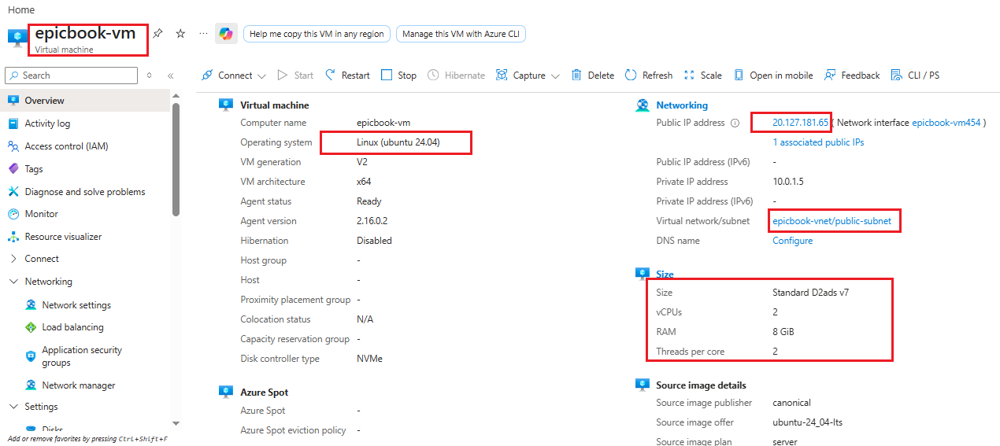

---

#### Screenshot 5 — Terminal showing successful software installation or installed-version checks

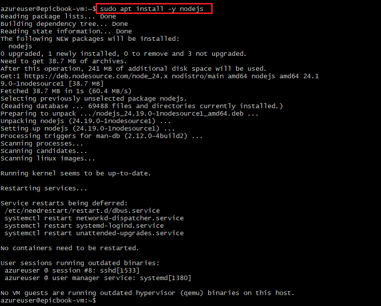

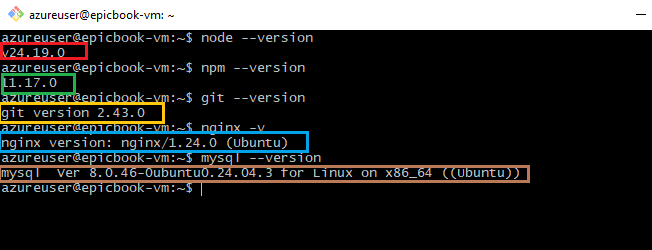

---

# Task 3 — Deploy the EpicBook Application

## Goal

Clone the EpicBook repository, install dependencies, build the frontend, configure Nginx to serve it, and configure the Node.js/Express.js backend to connect to MySQL using environment variables.

### Evidence

#### Screenshot 6 — Terminal showing the EpicBook repository cloned and dependencies installed

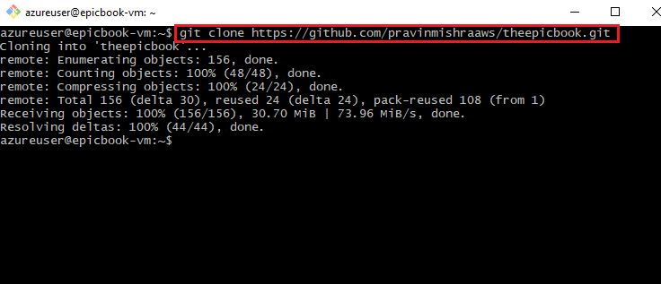

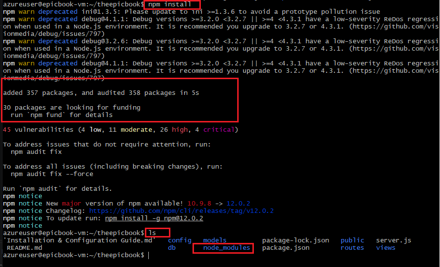

---

#### Screenshot 7 — Nginx configuration or service status proving the frontend is configured to be served

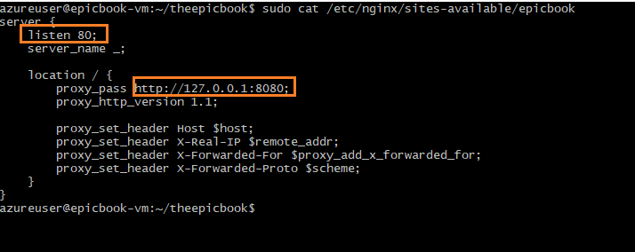
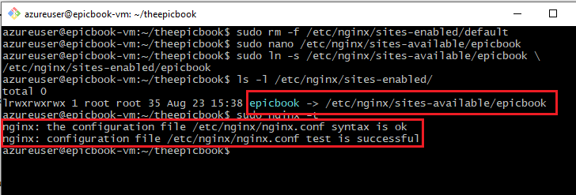

---

#### Screenshot 8 — Backend process or listening-port evidence (without exposing environment-variable secrets)

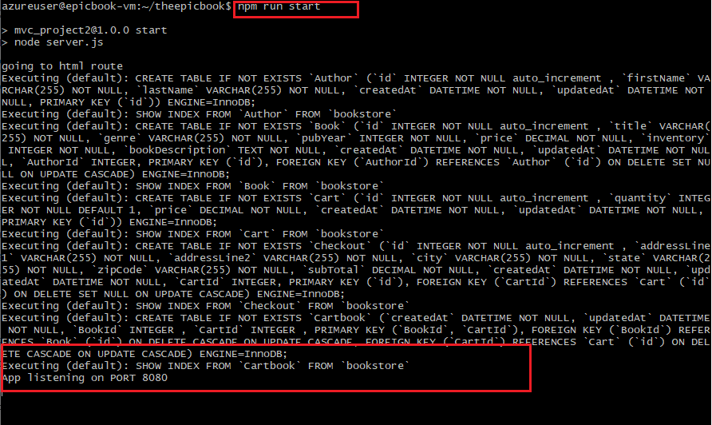
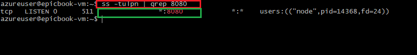

---

# Task 4 — Setup Azure Database for MySQL

## Goal

Create a private Azure Database for MySQL Flexible Server (VNet Integration) in the private subnet, create the database user and schema, import the SQL dump, and restrict access to the VM subnet only.

### Evidence

#### Screenshot 9 — MySQL Flexible Server overview showing Private access (VNet Integration)

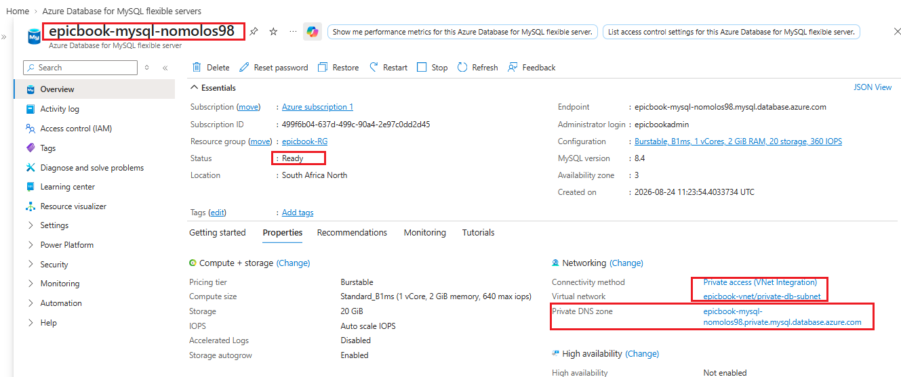

---

#### Screenshot 10 — Networking configuration showing the private subnet and restricted access

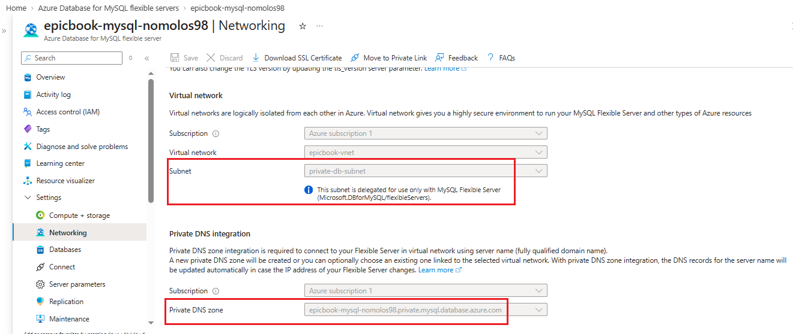

---

#### Screenshot 11 — MySQL Client output showing the EpicBook database or imported tables (no password visible)

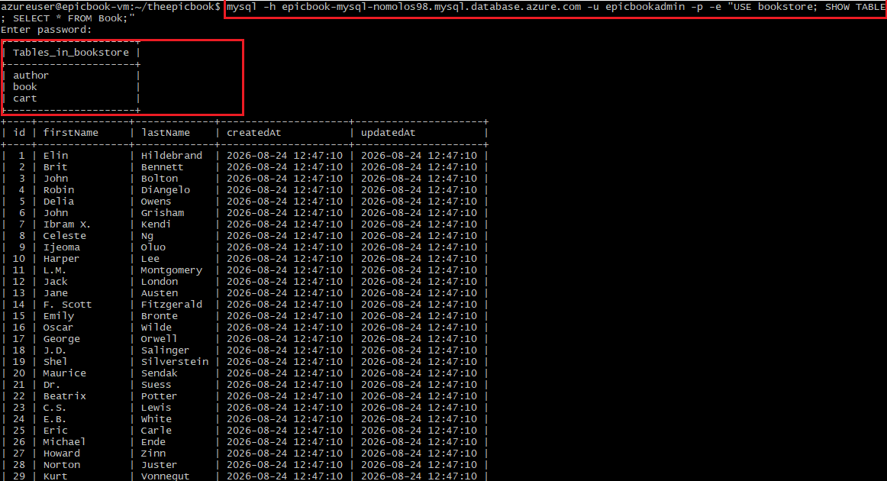

---

# Task 5 — Test End-to-End Functionality

## Goal

Confirm the EpicBook application loads through the VM's public IP and that viewing products, adding items to the cart, and placing orders all work.

### Evidence

#### Screenshot 12 — Browser showing the EpicBook application with the Virtual Machine public IP visible

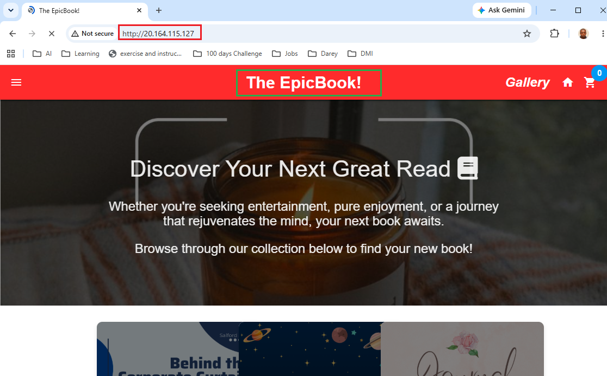

---

#### Screenshot 13 — Proof of a successful database-backed action (viewing products, adding to cart, or placing an order)

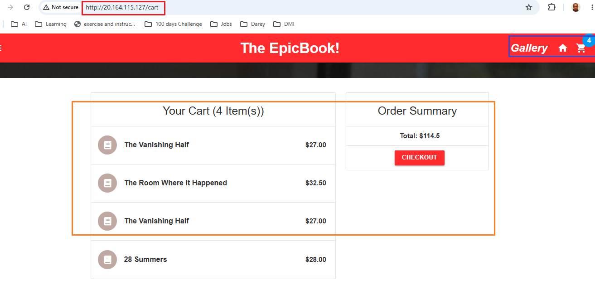

---

#### Public IP URL

Paste the public IP URL of your Virtual Machine here:

`20.164.115.127`

---

# Submission Instructions

- Add all required screenshots in your submission
- Include the Virtual Machine public IP URL
- Do not expose database passwords, connection strings, or subscription IDs

---

# Completion Checklist

- [ ] Task 1: Network foundation created with public/private subnets and NSGs (Screenshots 1–3)
- [ ] Task 2: VM provisioned and required software installed (Screenshots 4–5)
- [ ] Task 3: EpicBook frontend and backend deployed (Screenshots 6–8)
- [ ] Task 4: Private Azure Database for MySQL created and data imported (Screenshots 9–11)
- [ ] Task 5: End-to-end functionality validated (Screenshots 12–13, Public IP URL)
- [ ] No sensitive data exposed

---

## 📌 About DMI & CloudAdvisory

DevOps Micro Internship (DMI) is a project-based DevOps program run by Pravin Mishra (The CloudAdvisory) focused on real-world execution, systems thinking, and career readiness.

It helps learners build strong DevOps foundations with hands-on experience.

---

## 📌 Resources

- 🌐 DMI Official Website: https://dmi.pravinmishra.com?utm_source=github&utm_medium=readme  
- 🎓 University: https://university.pravinmishra.com?utm_source=github&utm_medium=readme  
- 💬 Discord Community: https://discord.pravinmishra.com?utm_source=github&utm_medium=readme  
- 📝 Blog: https://dmi.pravinmishra.com/blog?utm_source=github&utm_medium=readme  
- ▶️ YouTube Playlist: https://www.youtube.com/playlist?list=PLFeSNDtI4Cho  
- 🔗 Pravin Mishra (LinkedIn): https://www.linkedin.com/in/pravin-mishra-aws-trainer/  
- 🏢 CloudAdvisory (LinkedIn): https://www.linkedin.com/company/thecloudadvisory/

---

*This submission is part of DevOps Micro Internship (DMI) Cohort 3 — Agentic AI Track.*
