# Assignment 6 — Capstone: Deploy Book Review App (Three-Tier Architecture) on Azure

Part of the DevOps Micro Internship (DMI) Cohort 3 with Agentic AI

---

## Purpose

This is the most important assignment of the course. You will deploy the Book Review App in a production-ready, best-practice-compliant three-tier architecture on Azure: separated presentation, application, and database tiers, least-privilege network access, a controlled public entry point, protected secrets, and availability/monitoring evidence.

---

# Task 1 — Design the Azure Three-Tier Architecture

## Goal

Create an architecture diagram and implementation plan identifying the presentation, application, and database components, the chosen Azure services, the public entry point, and the internal traffic paths.

### Evidence

#### Screenshot 1 — Architecture diagram showing the public entry point, three tiers, network boundaries, and traffic flow

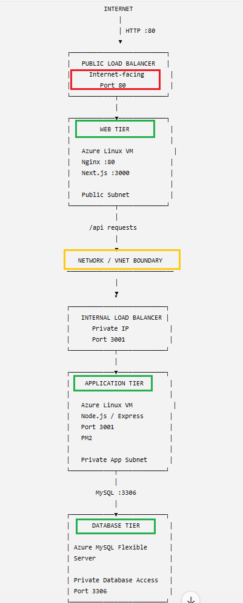

---

#### Screenshot 2 — Written architecture assumptions and selected Azure services

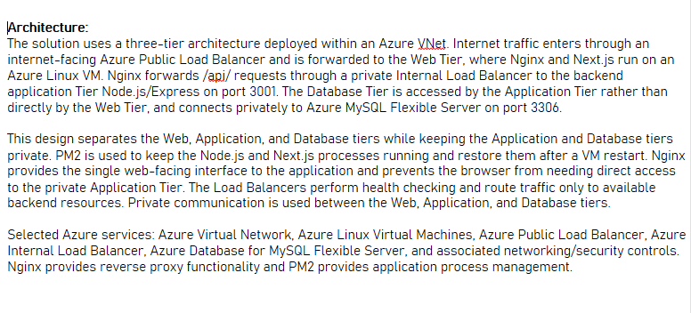

---

# Task 2 — Create the Azure Network Foundation

## Goal

Create a dedicated Resource Group and VNet with separate subnets for the web, application, and database tiers, keeping the application and database tiers without direct public access.

### Evidence

#### Screenshot 3 — Resource Group overview showing the assignment resources

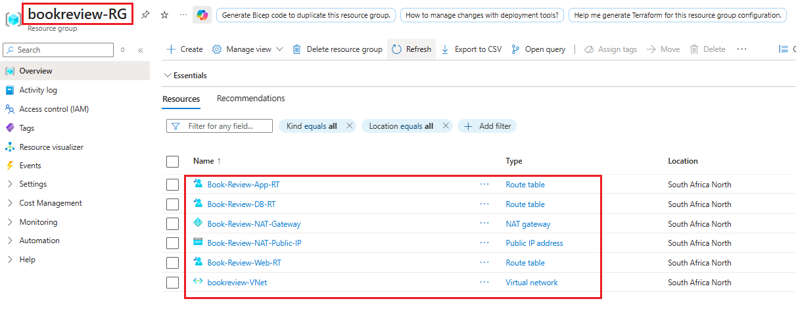

---

#### Screenshot 4 — VNet overview showing the address space and all required subnets


---

#### Screenshot 5 — Route-table or Private DNS evidence where applicable

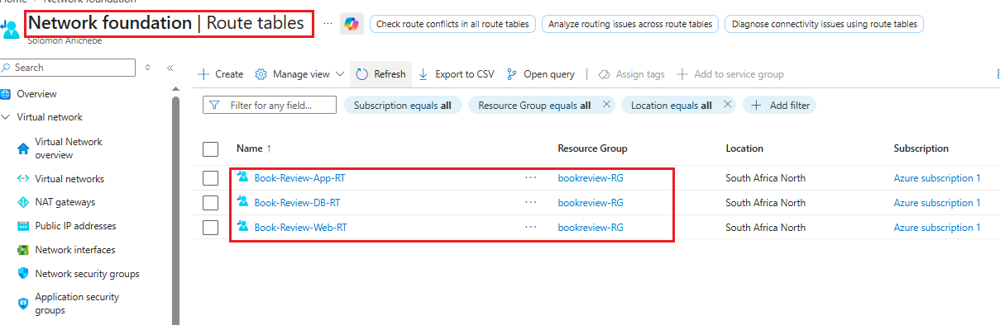

---

# Task 3 — Configure Security and Secret Management

## Goal

Apply least-privilege NSG rules so traffic flows Internet → public entry point → web tier → application tier → database tier, and store credentials in Azure Key Vault or another approved secure mechanism.

### Evidence

#### Screenshot 6 — NSG rules proving least-privilege access between the tiers

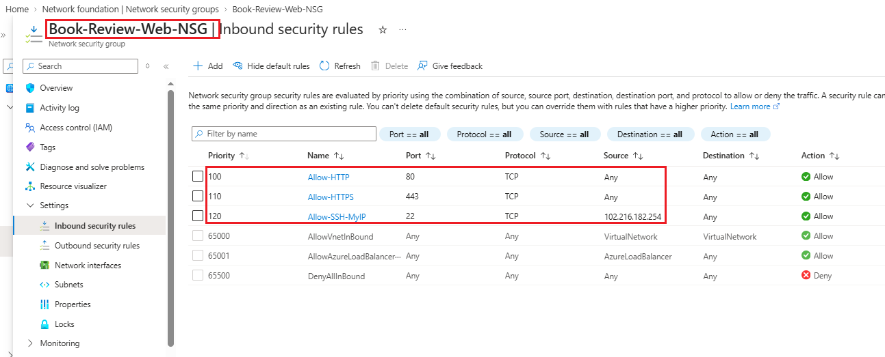

---

#### Screenshot 7 — Key Vault or approved secret-management configuration (without displaying secret values)

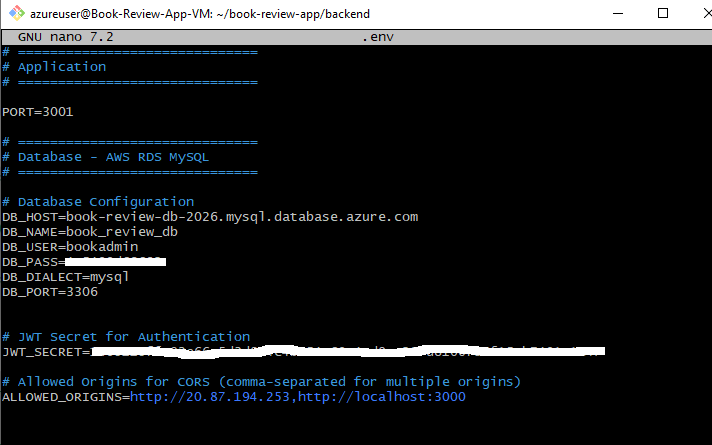

---

# Task 4 — Deploy the Presentation (Web) Tier

## Goal

Deploy the Book Review App presentation layer on the approved web-tier compute service, configured to route requests to the internal application-tier endpoint, and not directly exposed except through the public entry service.

### Evidence

#### Screenshot 8 — Web-tier compute overview showing subnet and availability configuration

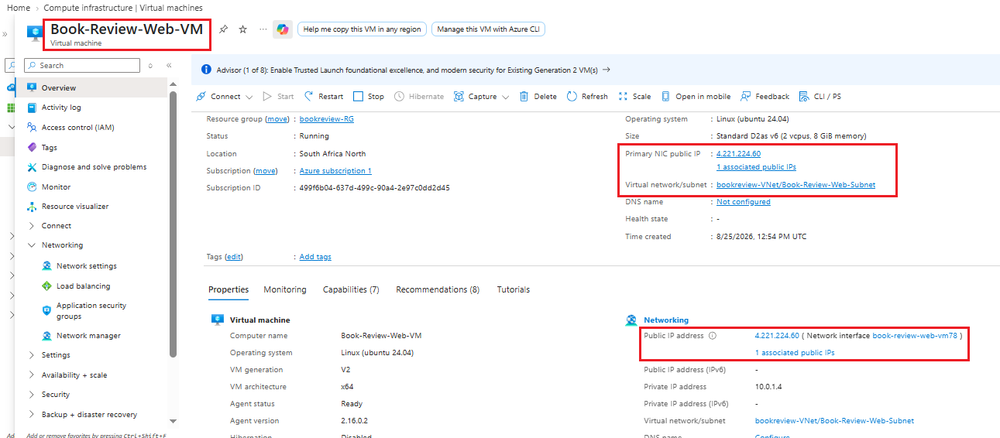

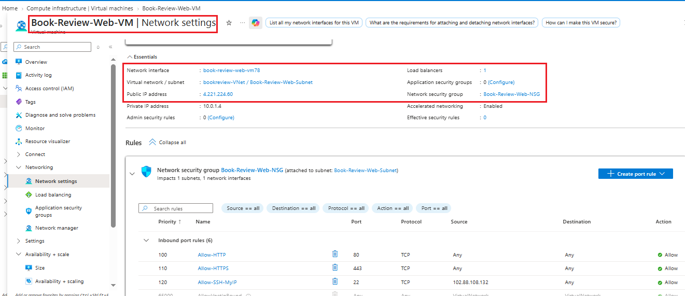

---

#### Screenshot 9 — Terminal or service output proving the presentation layer is running

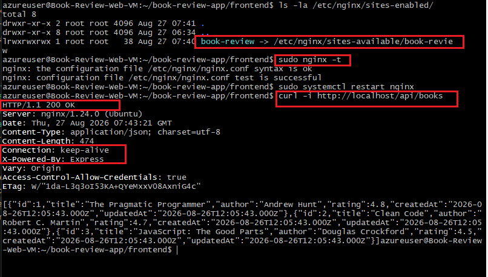

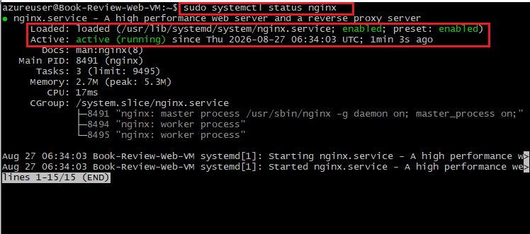

---

# Task 5 — Deploy the Business (Application) Tier

## Goal

Deploy the Book Review App backend privately in the application subnet, configured to use the private database endpoint and secured environment values, reachable only through its internal endpoint.

### Evidence

#### Screenshot 10 — Application-tier compute overview showing private subnet placement

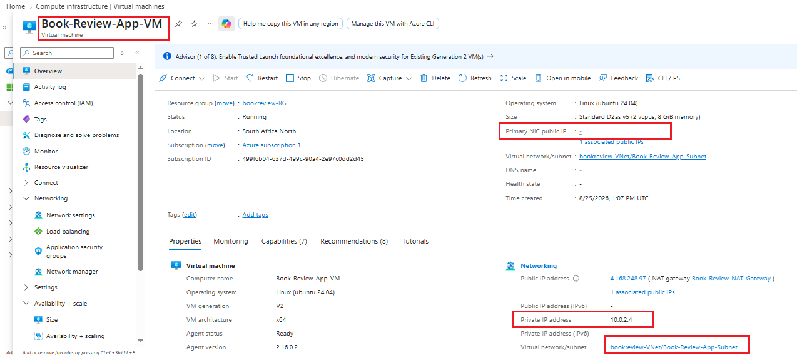

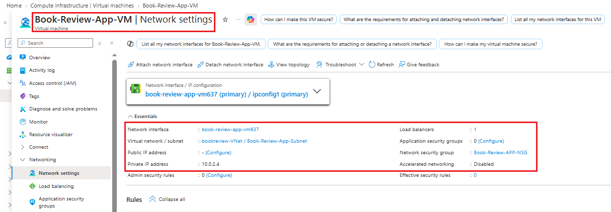

---

#### Screenshot 11 — Backend process, service, or listening-port evidence

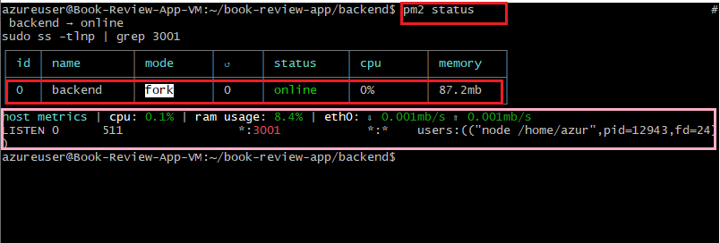

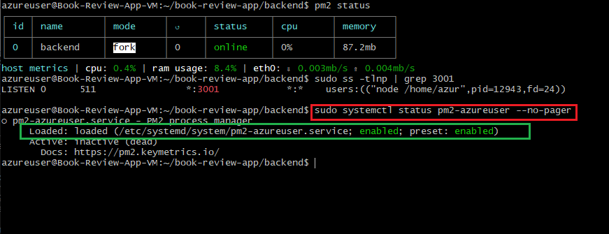

---

#### Screenshot 12 — Internal health-check or API response (without exposing secrets)

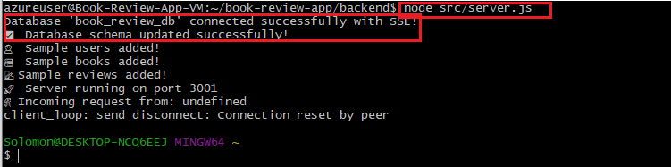

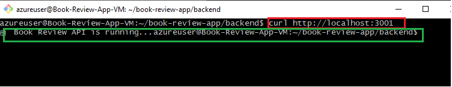

The Application Tier was validated locally on the private App VM using curl http://localhost:3001. The Book Review API returned "Book Review API is running...", confirming that the Node.js/Express backend is listening and responding on port 3001.

Application VM
      ↓
localhost:3001
      ↓
Node.js / Express
      ↓
Book Review API
      ↓
Successful response

---

# Task 6 — Deploy the Managed Database Tier

## Goal

Create a private Azure managed database (public access disabled), with availability/backup/retention settings, the Book Review App schema imported, and access restricted to the application tier only.

### Evidence

#### Screenshot 13 — Database overview showing private connectivity and public access disabled

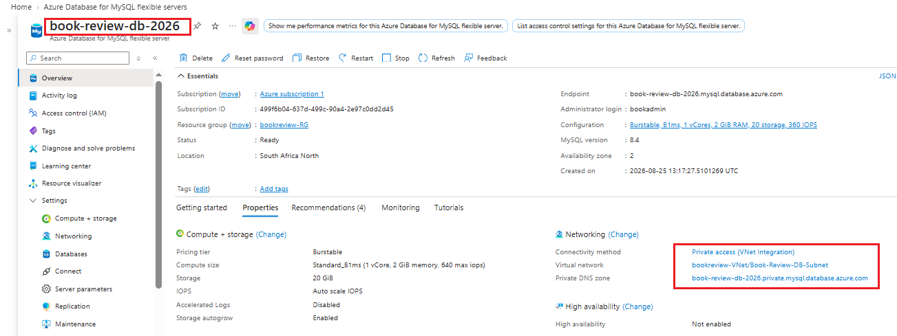

---

#### Screenshot 14 — Availability, backup, and retention configuration

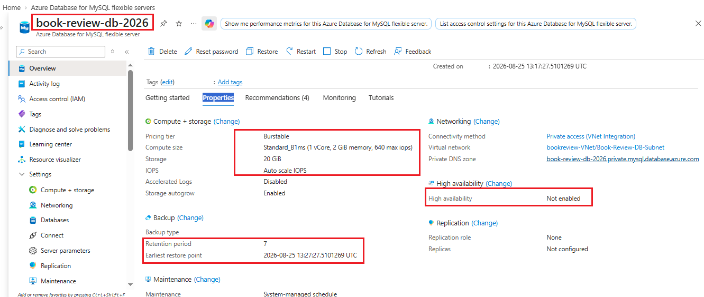

---

#### Screenshot 15 — Successful schema or connectivity verification (without exposing credentials)

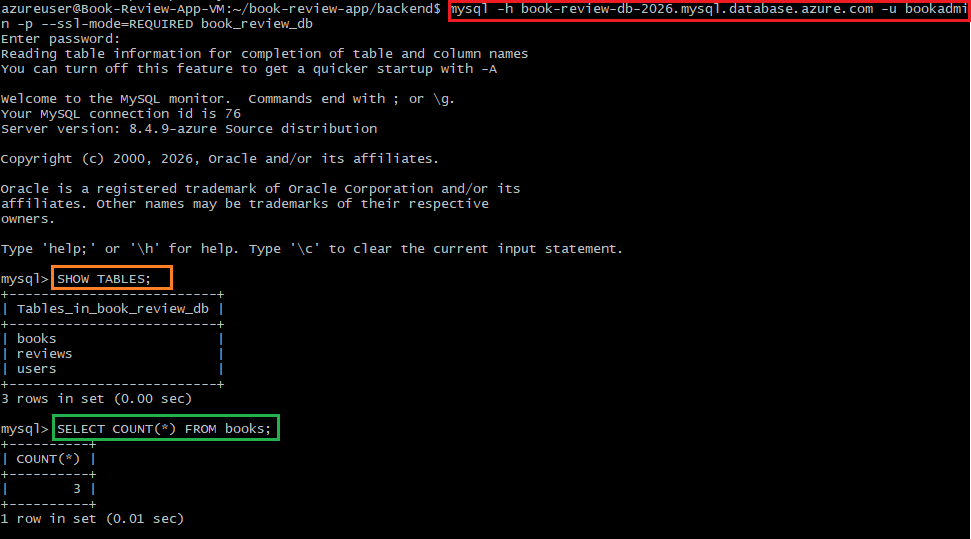

---

# Task 7 — Configure Traffic Management, Availability, and Monitoring

## Goal

Configure the approved public entry service with health probes and backend pools, internal routing for the application tier where required, and enable Azure Monitor/diagnostics/logs/alerts for the key resources.

### Evidence

#### Screenshot 16 — Public entry service showing listener, frontend endpoint, and healthy web targets

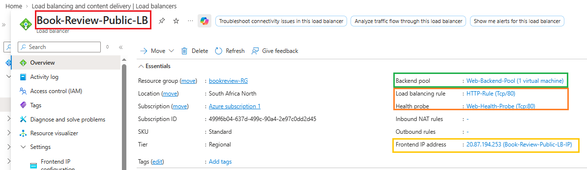

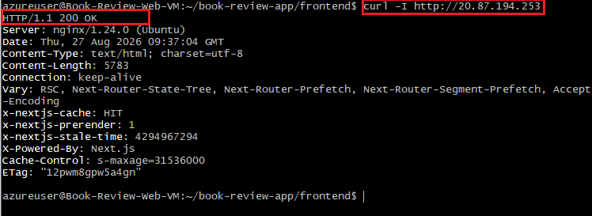

This is Live proof, not just config

---

#### Screenshot 17 — Internal application-tier load-balancing or routing configuration where applicable

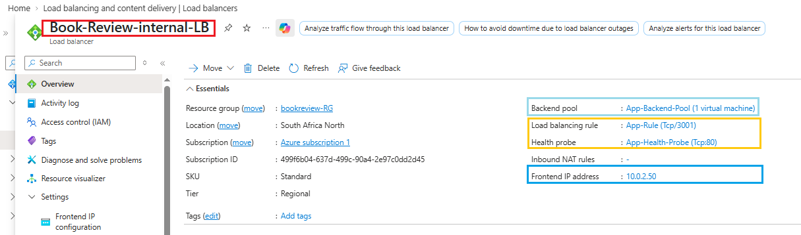

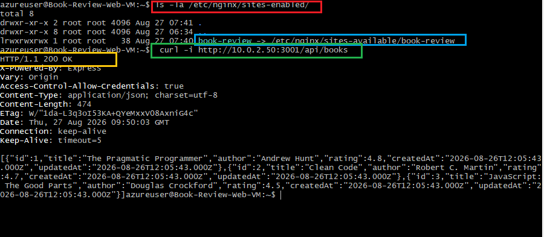

This confirm only book-review is enabled, and the location /api/ block points to http://10.0.2.50:3001/api/

---

#### Screenshot 18 — Azure Monitor, diagnostic settings, logs, metrics, or alert evidence

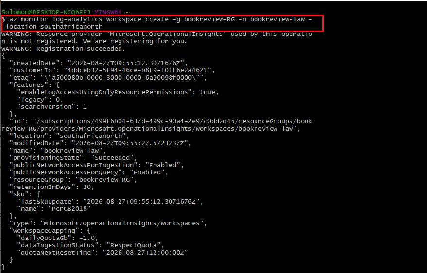

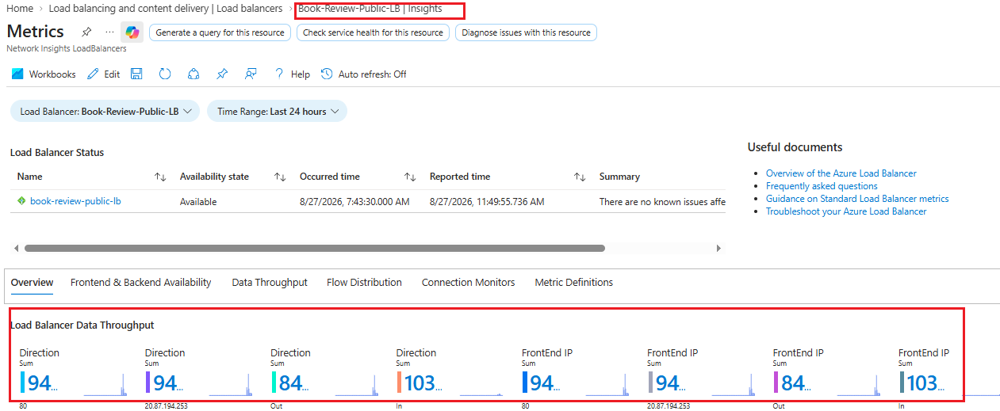

---

# Task 8 — Validate the Production-Style Deployment

## Goal

Confirm the Book Review App works end to end through the public endpoint, with at least one database read and one write, confirm private tiers are not internet-reachable, and complete a safe availability test.

### Evidence

#### Screenshot 19 — Browser showing the Book Review App through the public endpoint

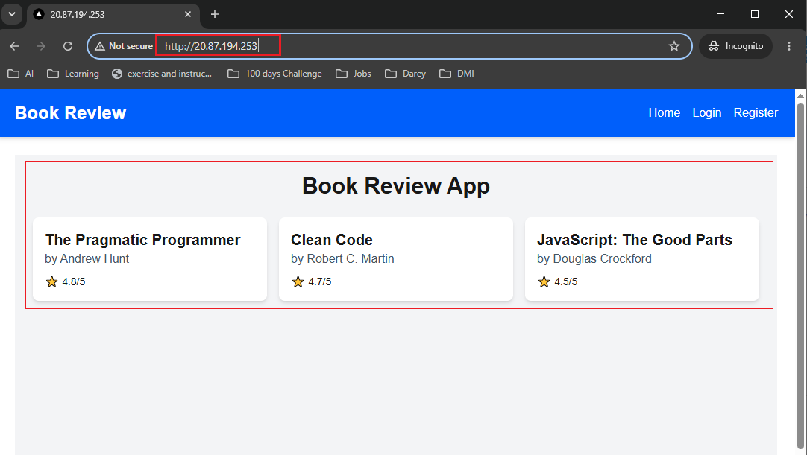

---

#### Screenshot 20 — Proof of successful database-backend read and write operations

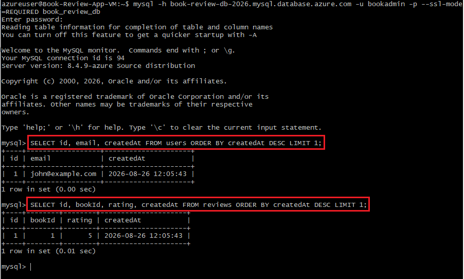

---

#### Screenshot 21 — Evidence that private tiers are not publicly accessible

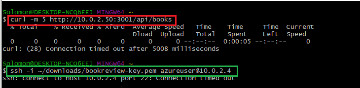

---

#### Screenshot 22 — Availability-test and healthy-target evidence

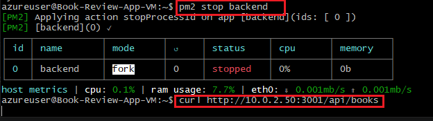

---

#### Public Endpoint

Paste your public endpoint URL here:

`http://20.87.194.253/`

---

### Notes

Summarize what worked, issues encountered and how they were fixed, and the availability/security/secrets/monitoring/backup choices made.

# Book Review App — Azure Deployment Retrospective

A three-tier web application (Next.js frontend, Node.js/Express backend, MySQL) deployed on Azure with network-isolated tiers, dual load balancers, and process persistence via PM2.

---

## 1. What worked, cleanly, on the first pass

- **Networking foundation** — VNet, three non-overlapping subnets, route tables, NAT Gateway, and tier-specific NSGs all provisioned and associated correctly with no rework needed.
- **Backend deployment** — Node.js/Express install, repo clone, `npm install`, MySQL connection over SSL, Sequelize schema sync, and sample data seeding all worked on the **first run**, no debugging required:
  ```
  Database 'book_review_db' connected successfully with SSL!
  ✅ Database schema updated successfully!
  🚀 Server running on port 3001
  ```
- **PM2 on the App VM** — install, start, save, `pm2 startup` registration with systemd, all straightforward.
- **Both Load Balancers, backend pool creation, NSG rules** — created without incident; the errors that did surface (below) were configuration-value mistakes, not structural ones.
- **Frontend build and Nginx installation** — Node/Nginx install, repo clone, `.env.local` setup, `npm run build` all completed cleanly.

## 2. Issues encountered, and how each was actually diagnosed and fixed

Three genuine, independent bugs surfaced during end-to-end testing — each isolated using the same method: test the narrowest possible layer first, then widen outward until the failure appears.

### Issue 1 — Internal Load Balancer health probe on the wrong port
**Symptom:** `curl http://10.0.2.50:3001/api/books` timed out from the Web VM, even though the backend itself was fully healthy.
**Diagnosis path:** Direct `curl` to the App VM's own private IP (`10.0.2.4:3001`) succeeded — ruling out the NSG and the app itself. That isolated the fault to the Internal LB specifically. `az network lb probe list` revealed the health probe was checking **port 80** (nothing listens there on the App VM) instead of **3001**.
**Fix:**
```
az network lb probe update --lb-name Book-Review-Internal-LB --resource-group bookreview-RG --name App-Health-Probe --port 3001
```
**Verified:** backend pool flipped to Healthy within ~15s; `curl` through the LB then returned the book list.

### Issue 3 — Client-side duplicated `/api/api/` path
**Symptom:** Homepage loaded through both the Web VM's IP and the Public LB, but showed **"No books available"** on every environment.
**Diagnosis path:** Browser DevTools → Network tab showed a request to `/api/api/books` returning a **404** with Express's own plain-text `Cannot GET /api/api/books` — proof the request *did* reach the backend correctly (ruling out every infrastructure layer), meaning the bug was purely client-side. `src/app/page.js` was hardcoding `${NEXT_PUBLIC_API_URL}/api/books`, while `NEXT_PUBLIC_API_URL` was already set to `/api` — doubling the prefix.
**Fix:** removed the redundant `/api` segment, then rebuilt (required, since `NEXT_PUBLIC_*` vars are baked into the client bundle at build time, not read at runtime):
```
npm run build
pm2 restart book-review-frontend
pm2 save
```
**Verified:** `grep -rn "NEXT_PUBLIC_API_URL" src/` confirmed no sibling instances of the bug; homepage rendered the seeded books afterward.

### Secrets management
- **Current state:** `DB_PASS` and `JWT_SECRET` live in plaintext in `.env` on the App VM (`chmod 600`, not committed to Git).
- **Recommended upgrade, designed but not yet implemented:** Azure Key Vault + the App VM's system-assigned managed identity, granted `Key Vault Secrets User` (read-only) via RBAC, pulling secrets via `az keyvault secret show` at deploy time rather than storing them permanently on disk.

### Monitoring
- Log Analytics workspace `bookreview-law` created and provisioning succeeded.
- Diagnostic settings (Load Balancer probe/alert events, MySQL slow/audit logs, VM Insights) were being configured resource-by-resource at the time of writing — **verify each with `az monitor diagnostic-settings list --resource NAME --resource-group RG --resource-type TYPE`** and confirm live data with a Kusto query against the workspace before treating this as complete.
- An alert rule on Internal LB health-probe status was designed (fires below 100% healthy) but should be confirmed as actually created and tested against a real outage (e.g., via the `pm2 stop backend` availability test).

### Backups
- MySQL Flexible Server left on its **default backup configuration** — 7-day retention, geo-redundant backup not enabled. A conscious choice for this build's scope; production use would warrant increasing retention (up to 35 days) and enabling geo-redundancy.

## 4. Final validated state

- Full request chain proven end to end: Browser → Public LB (`20.87.194.253`) → Web VM/Nginx → Internal LB (`10.0.2.50:3001`) → App VM → MySQL, with a successful register/login/review read-write cycle.
- Private-tier unreachability from the public internet (Internal LB, App VM, MySQL) — outlined for verification, should be confirmed with direct connection attempts from outside Azure.
- Availability failover test (`pm2 stop backend` → Unhealthy → site breaks → `pm2 start backend` → Healthy → site recovers) — outlined, pending execution and screenshot capture for final evidence.

---

# Submission Instructions

- Add all required screenshots and links in your submission
- Do not expose passwords, keys, connection strings, or subscription IDs

---

# Completion Checklist

- [ ] Task 1: Architecture diagram and assumptions documented (Screenshots 1–2)
- [ ] Task 2: Network foundation created with isolated tiers (Screenshots 3–5)
- [ ] Task 3: Least-privilege security and secret management configured (Screenshots 6–7)
- [ ] Task 4: Presentation tier deployed (Screenshots 8–9)
- [ ] Task 5: Application tier deployed privately (Screenshots 10–12)
- [ ] Task 6: Managed database tier deployed privately (Screenshots 13–15)
- [ ] Task 7: Public entry, internal routing, and monitoring configured (Screenshots 16–18)
- [ ] Task 8: End-to-end validation and availability test completed (Screenshots 19–22, Public Endpoint, Notes)
- [ ] No sensitive data exposed

---

## 📌 About DMI & CloudAdvisory

DevOps Micro Internship (DMI) is a project-based DevOps program run by Pravin Mishra (The CloudAdvisory) focused on real-world execution, systems thinking, and career readiness.

It helps learners build strong DevOps foundations with hands-on experience.

---

## 📌 Resources

- 🌐 DMI Official Website: https://dmi.pravinmishra.com?utm_source=github&utm_medium=readme  
- 🎓 University: https://university.pravinmishra.com?utm_source=github&utm_medium=readme  
- 💬 Discord Community: https://discord.pravinmishra.com?utm_source=github&utm_medium=readme  
- 📝 Blog: https://dmi.pravinmishra.com/blog?utm_source=github&utm_medium=readme  
- ▶️ YouTube Playlist: https://www.youtube.com/playlist?list=PLFeSNDtI4Cho  
- 🔗 Pravin Mishra (LinkedIn): https://www.linkedin.com/in/pravin-mishra-aws-trainer/  
- 🏢 CloudAdvisory (LinkedIn): https://www.linkedin.com/company/thecloudadvisory/

---

*This submission is part of DevOps Micro Internship (DMI) Cohort 3 — Agentic AI Track.*
